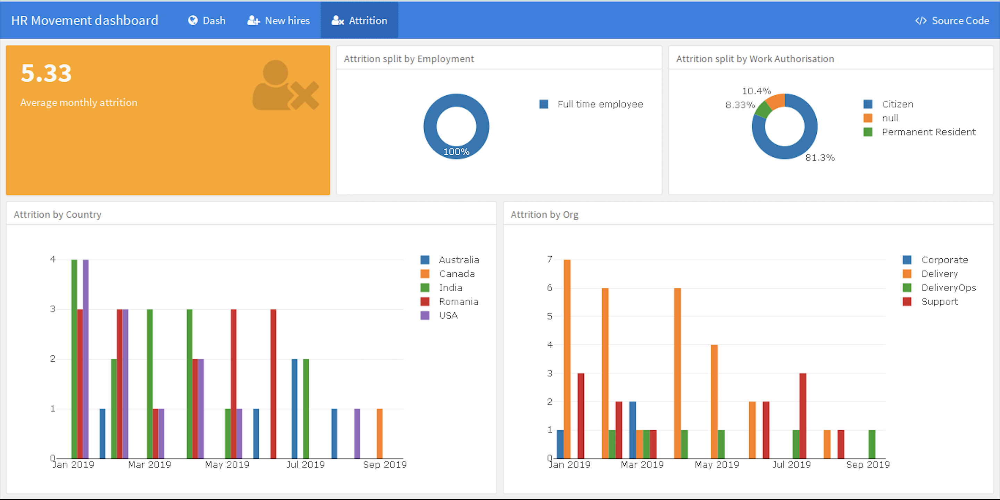
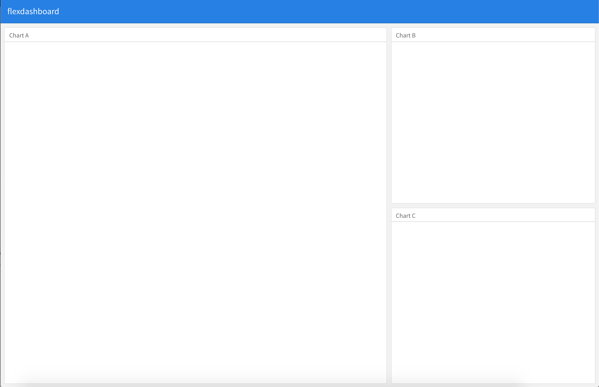
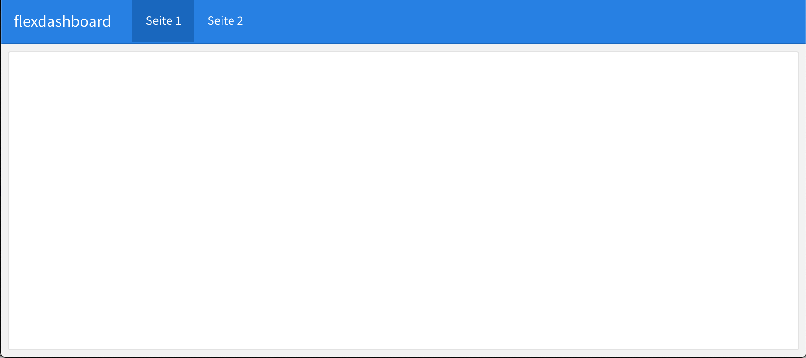
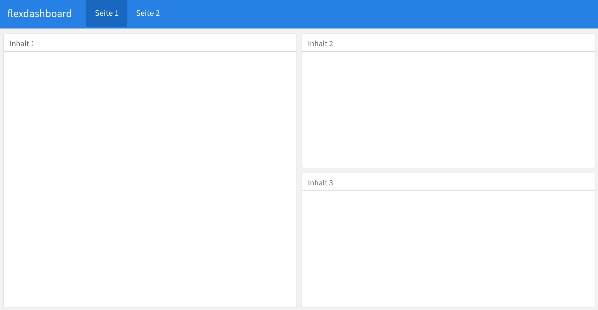
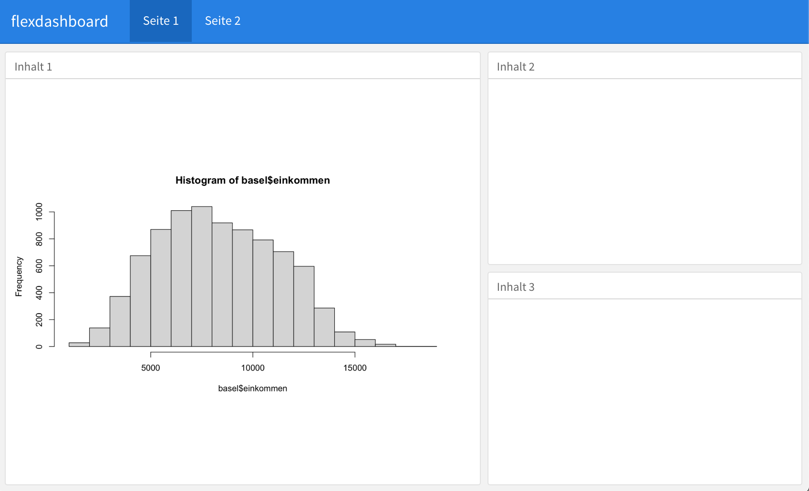
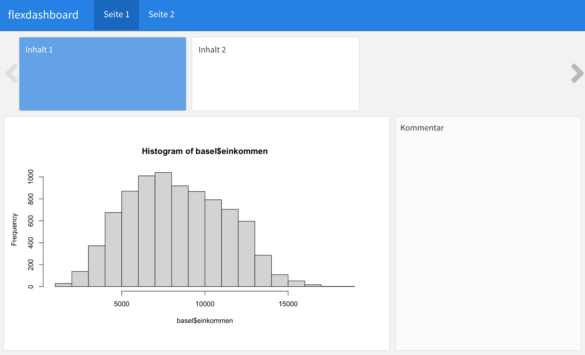
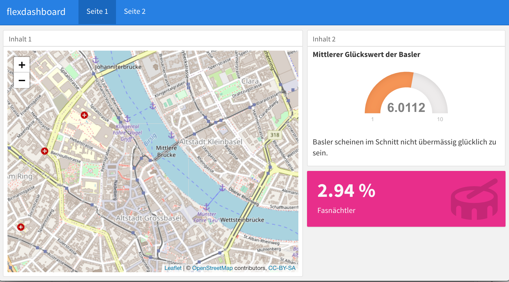
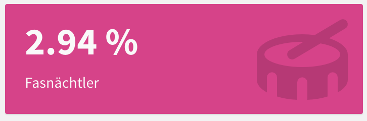
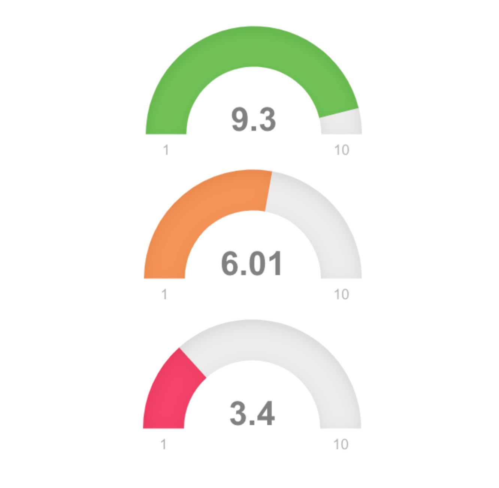

layout: true

<div class="my-footer">
  <span style="text-align:center">
    <span> 
      
    </span>
    <a href="https://therbootcamp.github.io/">
      <span style="padding-left:82px"> 
        <font color="#7E7E7E">
          www.therbootcamp.com
        </font>
      </span>
    </a>
    <a href="https://therbootcamp.github.io/">
      <font color="#7E7E7E">
       Reporting mit R | Juni 2020
      </font>
    </a>
    </span>
  </div> 

---

```{r setup, include=FALSE}
options(htmltools.dir.version = FALSE)
options(width = 110)
options(digits = 4)

# Load packages
require(tidyverse)
library(leaflet)
library(plotly)

# load color set
source("../../_materials/palette/therbootcamp_palettes.R")

# knitr options
knitr::opts_chunk$set(dpi = 300, echo = FALSE, warning = FALSE, fig.align = 'center', message= FALSE)

# special print function: avoid if possible
print2 <- function(x, nlines=10,...) {
   cat(head(capture.output(print(x,...)), nlines), sep="\n")}

basel <- read.csv("1_Data/basel.csv")

```

# Was sind Dashboards?

.pull-left4[

<ul>
  <li class="m1"><span>Typischerweise einzelseitige Präsentation von Resultaten.</span></li> 
  <li class="m2"><span>Präsentation zusammengehöriger Analysen.</span></li>  
  <li class="m3"><span>Geben einfache Übersicht über wichtigste Parameter/KPI (Key Performance Indicators).</span></li>
  <li class="m4"><span>Können dynamisch und interaktiv sein.</span></li>
</ul>

]

.pull-right5[

<p align = "center">
  <br>
  <font style="font-size:10px">from <a href="https://towardsdatascience.com/building-an-hr-dashboard-in-r-using-flexdashboard-76d14ed3f32">towardsdatascience.com</a></font>
</p>

]

---

# Dashboards bieten...

.pull-left4[
<ul>
  <li class="m1"><span>Einfache Übersicht.</span></li>  
  <li class="m2"><span>Performance Masse.</span></li>
  <li class="m3"><span>Storyboards.</span></li>
  <li class="m4"><span>Dynamik und Interaktivität.</span></li>
</ul>


]

.pull-right5[

<p align = "center">
  <br>
  <font style="font-size:10px">from <a href="https://towardsdatascience.com/building-an-hr-dashboard-in-r-using-flexdashboard-76d14ed3f32">towardsdatascience.com</a></font>
</p>

]

---

# Ein Beispiel

<p align = "center">
  <iframe src="https://jjallaire.shinyapps.io/shiny-crandash/#dashboard" width="100%%" height="450" style="border:none;">
</iframe><br>
  <font style="font-size:10px">from <a href="https://jjallaire.shinyapps.io/shiny-crandash/#dashboard">rstudio.com</a></font>
</p>

---

# Ein Beispiel

<p align = "center">
  <iframe src="https://therbootcamp.github.io/RmR_2020Jun/_sessions/DashboardsI/app/BerlinDashboard.html" width="100%%" height="450" style="border:none;">
</iframe><br>
  <font style="font-size:10px">from <a href="https://therbootcamp.github.io/">therbootcamp.com</a></font>
</p>


---

# Layout

.pull-left4[
<ul>
  <li class="m1"><span>Headers bestimmen die Boxen und Seiten.</span></li>  
  <li class="m2"><span>Standardmässig eine Seite; scrollable und mehrere Seiten
  möglich.</span></li>
  <li class="m3"><span>Standardmässig spaltenweise; zeilenweise möglich.</span></li>
  <li class="m4"><span>Standardmässig eine Spalte; mehrere möglich.</span></li>
  <li class="m5"><span>Tabs möglich.</span></li>
</ul>


]

.pull-right5[

<p align = "center">
  
</p>

]

---

# Layout - Seiten

.pull-left4[
<ul>
  <li class="m1"><span>Seiten werden mit Titel erster Ordnung definiert.</span></li> 
  <li class="m2"><span>Konvention: Statt <highm>#</highm> wird <highm>=====</highm> verwendet.</span></li> 

</ul>

````markdown
Seite 1
====================================
  
Seite 2
====================================
```` 


]

.pull-right5[
<br>
<p align = "center">
  
</p>

]

---

# Layout - Spalten/ Zeilen

.pull-left4[
<ul>
  <li class="m1"><span>Spalten/Zeilen werden mit Titel zweiter Ordnung definiert.</span></li> 
  <li class="m2"><span>Konvention: Statt <highm>##</highm> wird <highm>----</highm> verwendet.</span></li> 

</ul>

````markdown
Seite 1
====================================
  
Spalte 1
------------------------------------
  
Spalte 2
------------------------------------
````


]

.pull-right5[
<br>
<p align = "center">
  
</p>

]


---

# Layout - Spalten/ Zeilen

.pull-left4[
<ul>
  <li class="m1"><span>Spalten/Zeilen werden mit Titel dritter Ordnung weiter unterteilt</span></li> 
  <li class="m2"><span>Konvention: Hier wird ganz normal <highm>###</highm> verwendet.</span></li> 

</ul>

````markdown
Seite 1
====================================
  
Spalte 1
------------------------------------
  
### Inhalt 1

  
Spalte 2
------------------------------------
  
### Inhalt 2
  
### Inhalt 3
````


]

.pull-right5[
<br>
<p align = "center">
  
</p>

]

---

# Layout - Spalten/ Zeilen

.pull-left4[
<ul>
  <li class="m1"><span>Spaltenbreite/Zeilenhöhe kann mit <highm>{data-width = XXX}</highm> und <highm>{data-height = XXX}</highm> angepasst werden.</span></li> 

</ul>

````markdown
Seite 1
====================================
  
Spalte 1 {data-width = 700}
------------------------------------
  
### Inhalt 1

`r ''````{r fig.width=9}
hist(basel$einkommen)
```
  
Spalte 2
------------------------------------
  
### Inhalt 2
  
### Inhalt 3
````


]

.pull-right5[
<br>
<p align = "center">
  
</p>

]

---

# Layout - Storyboard

.pull-left4[
<ul>
  <li class="m1"><span>Mit <highm>{.storyboard}</highm> wird eine Seite als Storyboard deviniert</span></li>
  <li class="m2"><span>In Storyboards sind keine Titel zweiter Ordnung nötig.</span></li> 
  <li class="m3"><span>Mit <highm>***</highm> wird eine Kommentarspalte definiert.</span></li> 

</ul>


````mardown
Seite 1 {.storyboard}
====================================
  
### Inhalt 1

Hauptinhalt
  
 ***
  
Kommentar

### Inhalt 2
````


]

.pull-right5[
<br>
<p align = "center">
  
</p>

]

---

# Komponenten

.pull-left4[
<ul>
  <li class="m1"><span>Grafiken.</span></li>  
  <li class="m2"><span>Tabellen.</span></li>
  <li class="m3"><span><a href="http://stephanieevergreen.com/problem-with-dashboards/">Text</a>.</span></li>
  <li class="m4"><span><mono>valueBox</mono>es.</span></li>
  <li class="m5"><span><mono>gauge</mono>s.</span></li>
  <li class="m6"><span>htmlwidgets.</span></li>
</ul>


]

.pull-right5[
<br>
<p align = "center">
  
</p>

]

---

# <mono>valueBox</mono>

.pull-left5[

<ul>
  <li class="m1"><span>Zeige wichtige Werte.</span></li>  
  <li class="m2"><span>Grosse Auswahl an Icons:</span></li>
  <ul class="level">
    <li><span><a href="https://fontawesome.com/">Font Awesome</a> Icons mit <mono>"fa-NAME"</mono>.</li></span>
    <li><span><a href="https://ionicons.com/">Ionicons</a> mit <mono>"ion-NAME"</mono>.</li></span>
    <li><span><a href="https://www.glyphicons.com/">Glyphicons</a> mit <mono>"glyphicon-NAME"</mono>.</li></span>
  </ul>
</ul>

```{r eval = FALSE, echo =TRUE}

valueBox(WERT,
         caption = "TITEL",
         icon = "ICON",
         color = "FARBE")

```


]

.pull-right4[

<br>
<p align = "center">
  
</p>


]

---

# <mono>gauge</mono>

.pull-left5[

<ul>
  <li class="m1"><span>Zeige wichtige Werte in relation zur Skala.</span></li>  
  <li class="m2"><span>Balkenfarbe kann nach Werten variieren.</span></li>
</ul>

```{r eval = FALSE, echo =TRUE}

gauge(WERT, min = MIN, max = MAX,
      gaugeSectors(
        success = c(MIN_S, MAX),
        warning = c(MIN_W, MAX_W),
        danger = c(MIN, MAX_D)
      ))

```


]

.pull-right4[

<p align = "center">
  
</p>


]

---

# <mono>gauge</mono>

.pull-left5[

<ul>
  <li class="m1"><span>Zeige wichtige Werte in relation zur Skala.</span></li>  
  <li class="m2"><span>Balkenfarbe kann nach Werten variieren.</span></li>
</ul>

```{r eval = FALSE, echo =TRUE}

gauge(round(mean(basel$glueck), 2),
      min = 1, max = 10,
      gaugeSectors(
        success = c(8, 10),
        warning = c(5, 7),
        danger = c(0, 4)
        ))

```


]

.pull-right4[

<p align = "center">
  
</p>


]

---

# htmlwidgets - <mono>leaflet</mono>

.pull-left45[

<ul>
  <li class="m1"><span>Interface zu JS library.</span></li>  
  <li class="m2"><span>Einfaches Erstellen interaktiver Karten.</span></li>
</ul>

```{r eval = FALSE, echo =TRUE}
# Initiiere leaflet
leaflet() %>% 
  # Setze Anfangskoordinaten und Zoomwert
  setView(lng = 7.5885761,
          lat = 47.5595986,
          zoom = 15) %>% 
  # Zeichne Karte
  addTiles()
```


]

.pull-right45[

```{r fig.width = 1.75, fig.height = 1.5}
# Initiiere leaflet
leaflet() %>% 
  # Setze Anfangskoordinaten und Zoomwert
  setView(lng = 7.5885761, lat = 47.5595986, zoom = 15) %>% 
  # Zeichne Karte
  addTiles()
```

]

---

# htmlwidgets - <mono>leaflet</mono>

.pull-left45[

<ul>
  <li class="m1"><span>Interface zu JS library.</span></li>  
  <li class="m2"><span>Einfaches Erstellen interaktiver Karten.</span></li>
</ul>

```{r eval = FALSE, echo =TRUE}
# Initiiere leaflet
leaflet() %>% 
  # Setze Anfangskoordinaten und Zoomwert
  setView(lng = 7.5885761,
          lat = 47.5595986,
          zoom = 15) %>% 
  # Zeichne Karte
  addTiles() %>% 
  # Zeichne Marker
  addCircleMarkers(
    lng = 7.589263051748261,
    lat = 47.55892108771642)
```


]

.pull-right45[

```{r fig.width = 1.75, fig.height = 1.5}
# Initiiere leaflet
leaflet() %>% 
  # Setze Anfangskoordinaten und Zoomwert
  setView(lng = 7.5885761,
          lat = 47.5595986,
          zoom = 15) %>% 
  # Zeichne Karte
  addTiles() %>% 
  # Zeichne Marker
  addCircleMarkers(
    lng = 7.589263051748261,
    lat = 47.55892108771642)
```

]

---

# htmlwidgets - <mono>leaflet</mono>

.pull-left45[

<ul>
  <li class="m1"><span>Interface zu JS library.</span></li>  
  <li class="m2"><span>Einfaches Erstellen interaktiver Karten.</span></li>
</ul>

```{r eval = FALSE, echo =TRUE}
# Initiiere leaflet
leaflet() %>% 
  # Setze Anfangskoordinaten und Zoomwert
  setView(lng = 7.5885761,
          lat = 47.5595986,
          zoom = 15) %>% 
  # Zeichne Karte
  addTiles() %>% 
  # Zeichne Marker
  addAwesomeMarkers(
    lng = 7.589263051748261,
    lat = 47.55892108771642,
    icon = awesomeIcons(
          icon = "university",
          library = "fa"))
```


]

.pull-right45[

```{r fig.width = 1.75, fig.height = 1.5}
# Initiiere leaflet
leaflet() %>% 
  # Setze Anfangskoordinaten und Zoomwert
  setView(lng = 7.5885761,
          lat = 47.5595986,
          zoom = 15) %>% 
  # Zeichne Karte
  addTiles() %>% 
  # Zeichne Marker
  addAwesomeMarkers(
    lng = 7.589263051748261,
    lat = 47.55892108771642,
    icon = awesomeIcons(icon = "university",
      library = "fa"))
```

]

---

# htmlwidgets - <mono>plotly</mono>

.pull-left45[

<ul>
  <li class="m1"><span>Interface zu JS library.</span></li>  
  <li class="m2"><span>Einfaches Erstellen interaktiver Plots; vor allem aus <mono>ggplot2</mono> Objekten.</span></li>
</ul>

```{r eval = FALSE, echo =TRUE}
p <- ggplot(basel,
            aes(alter, arztbesuche,
                col = geschlecht)) + 
  geom_point(alpha = .2) +
  geom_smooth() +
  theme_light()
  
ggplotly(p)
```


]

.pull-right45[

<div align = "center">

```{r fig.width = 1.75, fig.height = 1.5}
p <- ggplot(basel,
            aes(alter, arztbesuche,
                col = geschlecht)) + 
  geom_point(alpha = .2) +
  geom_smooth() +
  theme_light()
  
ggplotly(p)
```
</div>
]


---

class: middle, center

<h1><a href="https://therbootcamp.github.io/RmR_2020Jun/_sessions/DashboardsI/DashboardsI_practical.html">Practical</a></h1>

