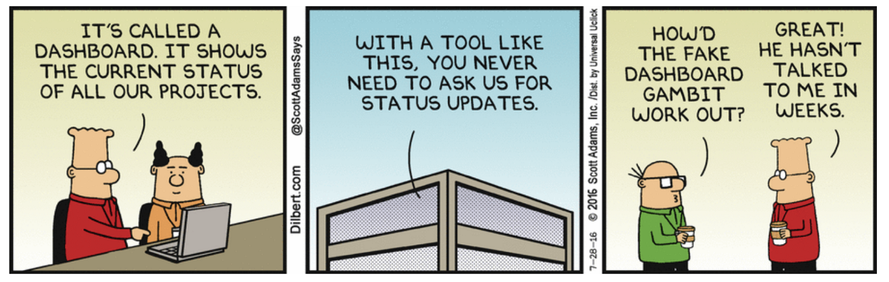

```{r setup, echo = FALSE, message = FALSE, warning = FALSE}
knitr::opts_chunk$set(comment = NA, 
                      fig.width = 6, 
                      fig.height = 6,
                      fig.align = 'center',
                      echo = TRUE, 
                      eval = FALSE, 
                      warning = FALSE,
                      tidy.opts=list(width.cutoff=60),tidy=TRUE)

options(digits = 3)

# Load packages
library(tidyverse)

```

<p align="center" width="100%">
  
  <br>
  <font style="font-size:10px">from <a href="https://dilbert.com/">https://dilbert.com/</a></font>
</p>


# {.tabset}

## Überblick

In diesem Practical übst du, (dynamische) Dashboards in Markdown zu erstellen. Genauer wirst du [dieses](https://therbootcamp.github.io/RmR_2020Jun/_sessions/DashboardsI/BerlinDashboard.html) Dashboard erstellen.

Am Ende des Practicals wirst du wissen wie man:

1. Dashboard-Layouts bestimmt.
2. Die einzelnen Komponenten mit Inhalt füllst.
3. Ein Storyboard erstellst.
4. Karten mit `leaflet` plottest.
5. Grafiken mit `plotly` aufpeppst.

## Aufgaben

### A - Setup

1. Öffne dein `TheRBootcamp` R Projekt. Es sollte die Ordner `1_Data` und `2_Code` enthalten. Stelle sicher, dass du alle Datensätze, welche im `Datensätze` Tab aufgelistet sind, in deinem `1_Data` Ordner hast. 

2. Öffne ein neues RMarkdown Skript und wähle das Template "Flex Dashboard" aus (siehe screenshot unten).

<p align="center" width="100%">
  
</p>


3. Speichere das neue Skript unter dem Namen `dashboards_I_practical.Rmd` im `2_Code` Ordner.

4. Schreibe als Titel "Dashboards I Practical" hinein.

### B - Setup

1. Lade die Pakete `tidyverse`, `plotly`, `leaflet`, `viridis`, `htmltools`, `lubridate`, `patchwork` und `flexdashboard` (letzteres sollte, wenn du das richtige Template ausgewählt hast, bereits als `library()` Befehl eingefügt sein) im Setup chunk.

```{r, echo = T, eval = T, message = F}
# Lade Pakete
library(flexdashboard)
library(tidyverse)
library(plotly)
library(leaflet)
library(viridis)
library(htmltools)
library(patchwork)
```


2. Lade den `airbnb` Datensatz mit `read_csv()` so wie du das in den bisherigen Practicals auch gemacht hast (die beiden Punkte am Anfang verlegen den Pfad um einen Ordner zurück.

```{r echo = TRUE}
airbnb <- read_csv("../XXX/XXX")
```


### C - Layout

Beim Erstellen eines Dashboards ist es hilfreich, sich von Beginn an ein Layout zurechtzulegen, welches man dann Schritt für Schritt auffüllt. Eine Skizze oder zumindest eine bildliche/ konzeptuelle Vorstellung ist daher wichtig. Zur Erinnerung, du wirst in diesem Practical  [dieses](https://therbootcamp.github.io/RmR_2020Jun/_sessions/DashboardsI/BerlinDashboard.html) Dashboard erstellen.

1.  Öffne den Link am besten in einem separaten Tab in deinem Browser. Wir werden während dieses Practicals immer wieder darauf verweisen.

2. Schau dir das Dashboard genau an, um einen Eindruck zu erhalten, was du genau nachbauen sollst, wie das Layout aussieht, und welche Komponenten verwendet werden. Wenn es dir hilft, mache dir eine Skizze vom Layout, sodass du eine Vorstellung der Ausrichtungen und Elemente erhälst.

3. Setze zunächst das Seitenlayout des Dashboards auf. Nenne die drei Seiten "Übersicht der Airbnbs in Berlin", "Entwicklung über Zeit" und "Bewertungen der Airbnbs". Schreibe dazu die Titel in dein Markdown unterhalb des setup R chunks und füge eine Zeile von Gleichheitszeichen `========` unter jedem Titel ein (dies entspricht Titeln der ersten Stufe, also was du bisher mit einem `#` gekennzeichnet hast; siehe auch Template unten).  

```
TITEL
======================================================================
```

4. In `flexdashboards` sind Seiten Standardmässig spaltenweise ausgerichtet. Schaue dir das [Dashboard](https://therbootcamp.github.io/RmR_2020Jun/_sessions/DashboardsI/BerlinDashboard.html) nochmals an. Sind alle drei Seiten spaltenweise ausgerichtet?

5. Genau, nur die zweite Seite ist spaltenweise ausgerichtet. Die erste Seite ist zeilenweise ausgerichtet, und die dritte Seite ist ein Storyboard. In einem Dashboard mit mehreren Seiten, kannst du jeweils nach dem Titel die Seitenausrichtung bestimmen, indem du für eine spalteinweise Ausrichtung `{data-orientation=columns}`, für eine zeilenweise Ausrichtung `{data-orientation=rows}` und für ein Storyboard `{.storyboard}` nach dem Titel (aber auf derselben Zeile) schreibst. Füge die entsprechende Ausrichtung nach den drei Titeln ein.

6. Nun beginnen wir mit dem Layout der einzelnen Seiten. Wir starten mit Seite 1. Du siehst, dass es zwei Zeilen gibt, eine mit den value Boxes, und eine mit der fancy Karte. Die Zeilen (oder Spalten, bei spaltenweisem Layout) werden mit Titel zweiter Ordnung (mit `##`) definiert. Bei `flexdashboar` verwenden wir dazu eine Zeile Minuszeichen (`-----`; siehe Template unten), dies ist jedoch nur eine Konvention. Füge zwei Zeilen, beide mit dem Namen "Zeile" ein (hier müssen keine sinnvollen Titel angegeben werden, da die Titel zweiter Ordnung nicht angezeigt werden). 

```
Zeile
----------------------------------------------------------------------
```

7. Wenn du das Dokument so knitten würdest, erhielten die beiden Zeilen gleich viel Platz. Die Karte soll jedoch mehr Platz erhalten. Füge dazu nach dem ersten Titel (`Zeile`, aber auf derselben Zeile im Code) folgenden Code ein: `{data-height = 400}`. Damit wird die Zeilenhöhe in Pixeln angegeben; die untere Zeile füllt dann den restlichen Platz aus.

8. Die obere Zeile mit den value Boxes, ist wiederum in drei Spalten unterteilt, eine für jede value Box. Verwende Titel dritter Ordnung um die Spalten mit den Namen "Superhosts", "Allstar", und "Preiswert" zu erstellen. Für diese Titel werden keine besonderen Zeichen verwendet, sondern wie gewohnt `###`.

9. Seite 1 ist vom Layout her fertig. Zeit Seite zwei vorzubereiten. Schaue sie dir dafür nochmals kurz an.

10. Wie du wahrscheinlich gesehen hast, sind es diesmal zwei Spalten. Überlege dir, wie du diese definieren würdest.

11. Genau, du kannst wie bei Aufgabe C6 Titel zweiter Ordnung hinzfügen. Füge die zwei Spalten, diesmal mit den Titeln "Spalte", unter dem Titel der zweiten Seite hinzu (also nach der Zeile mit den Gleichheitszeichen).

12. Wie auf Seite 1, musst du auch hier noch die Spalten anpassen. Dort hattest du mit `{data-height = 400}` die Höhe einer Zeile festgelegt. Die Breite eine Spalte kann analog mit `{data-width = XXX}` festgelegt werden. Definiere, dass die zweite Spalte 200 Pixel breit ist; die Erste wird dann automatisch angepasst.

13. Nun fehlen nur noch die Titel der beiden Spalten. Verwende dazu Titel dritter Ordnung (`###`) und nenne die linke Spalte "Entwicklung der Berliner Airbnbs seit 2009" und die rechte Spalte "Hintergründe". Füge diese Titel dritter Ordnung jeweils unter dem Titel zweiter Ordnung, welcher die Spalten definiert, ein.

14. So, nun fehlt nur noch das Layout der letzten Seite. Da es sich um ein Storyboard handelt, musst du keine Spalten oder Zeilen spezifizieren. Du kannst also direkt zu den Titeln dritter Ordnung übergehen.

15. Um die drei Abschnitte des Storyboards zu erstellen, verwende wiederum Titel dritter Ordnung (`###`). Erstelle drei Abschnitte mit den Namen "Gesamtrating", "Sauberkeit", und "Lage".

16. In den Abschnitten des Storyboards soll es jeweils einen Hauptteil (links), sowie rechts eine schmalere Spalte mit Kommentaren haben. Definiere die Breite der kleineren Kommentarspalte, indem du nach jedem der drei Titel, aber auf derselben Zeile, `{data-commentary-width=300}` einfügst.

17. Fast geschafft! Nur die Titel der Storyboardabschnitte sind noch etwas klein. Um sie zu vergrössern, musst du etwas HTML Syntax verwenden. Kopiere den untenstehenden Code und ersetze die Titel damit, und füge die Titelnamen von Aufgabe C15 in die `XXX` des Codes ein.

```
<span style="font-size: 20px;">XXX</span>
```

### D - Komponenten (ohne `htmlwidgets`)

Nun haben wir das Layout fertiggestellt und können die Komponenten einfüllen, also die anzuzeigenden Grafiken und Texte bestimmen.

1. Wir beginnen mit den value Boxes auf Seite 1. Um die erste valueBox zu erstellen, erstelle nach dem "Superhost" Titel einen R chunk.

2. Berechne im erstellten R chunk zuerst die Anzahl im `airbnb` Datensatz vorhandener Superhosts. Verwende dazu den untenstehenden Code.

```{r}
# berechne die Anzahl Superhosts im airbnb Datensatz
n_superhosts <- sum(airbnb$Host_superhost)
```

3. Erstelle nun eine value Box mit der `valueBox()` Funktion und zwar direkt unterhalb des Codes der Aufgabe D2. Gebe dabei als erstes Argument `n_superhost` ein und setze `caption` auf `"Superhost"`.

```{r}

# Erstelle valueBox
valueBox(XXX, caption = "XXX")

```

4. Funktioniert das schon so?

5. Funktioniert, aber ein paar Dinge fehlen noch. Zunächst stimmt die Farbe nicht. Füge in die `valueBox()` Funktion ein Argument `color` ein und setze dieses auf `"#008489"`.

6. Passt es jetzt?

7. Das Icon ist noch falsch. Füge in die `valueBox()` Funktion ein weiteres Argument `icon` ein und setze dieses auf `"fa-medal"`. 

8. Fast geschafft; der Titel ist noch etwas zu klein. Um das zu fixen, ersetze `"Superhost"` im `caption` Argument mit `"<h3 style='color: white;'>Superhost</h3>"`. Damit passt nun alles. Um die anderen beiden value Boxen kümmern wir uns später.

9. So, das war es für den Moment für diese Seite; die interaktiven Grafiken erstellen wir weiter unten. Gehe im Code zur zweiten Seite. Dort werden wir den Text erstellen.

10. Schaue dir den Text in der rechten Spalte des [Dashboards](https://therbootcamp.github.io/RmR_2020Jun/_sessions/DashboardsI/BerlinDashboard.html) an. Versuche ihn mit deinen bisher erworbenen RMarkdown Kenntnissen selbst nachzubauen (du darfst copy-pasten um nicht alles abschreiben zu müssen).

11. Du kannst deinen Text mit dem untenstehenden Text, mit dem diese Spalte tatsächlich erstellt wurde, vergleichen. Hast du alles gleich gemacht? Wo hast du andere Lösungen gefunden?

```{r highlight=FALSE}
**Airbnbs in Berlin**

Das erste Airbnb in Berlin öffnete 2009 im Stadtteil
[Pankow](https://de.wikipedia.org/wiki/Berlin-Pankow) 
(siehe auch [Übersichtskarte](#page-1)). Von da an war ein 
rascher Anstieg zu verzeichnen. Bereits 6 Jahre später gab 
es in Berlin-Pankow alleine `r round(10**2.3)` Airbnbs. 
Mittlerweile ist diese Zahl auf rund `r round(10**3.2 / 100) * 100` angestiegen.

Das teuerste heute verfügbare Airbnb kostet dabei `r max(airbnb$Preis)` 
pro Nacht; für die meisten Leute nicht gerade ein Schnäppchen. Dabei
handelt es sich um ein `r airbnb$Unterkunftsart[max(airbnb$Preis)]` 
im Stadtteil `r airbnb$Stadtteil[max(airbnb$Preis)]`.

Insgesammt wurden über die Jahre in Berlin `r
as.integer(sum(airbnb$host_anzahl))` Gäste in Airbnbs 
empfangen.

```

12. Das war es schon für diese Seite. Den Plot erstellen wir wiederum später. Gehe nun in deinem Dokument zur dritten Seite zum Titel "Gesamtrating" (Titel dritter Ordnung).

13. Erstelle unterhalb des Titels einen R chunk und füge den untenstehenden Code ein. Dieser erstellt die erste Grafik. Es fehlt leider die Zeit für genaue Erklärungen, aber der Code ist gut Kommentiert, sodass du einen Eindruck der durchgeführten Aktionen erhalten solltest. Mehr über Plotting mit `ggplot2` kannst du in unserem Kurs zu explorativer Datenanalyse mit R lernen. 

```{r}
## Erstelle das Histogramm der Gesamtratings
# Wähle die Rating_gesamt Variable zum Plotten aus
ggplot(airbnb, aes(Rating_gesamt)) +
  # Erstelle ein Histogramm mit Balkenbreite 1
  geom_histogram(binwidth = 1) +
  # Definiere die Achsenbeschriftungen
  labs(x = "Gesamtrating",
       y = "Häufigkeit") +
  # Definiere den Range der x-Achse von 0 bis 100
  coord_cartesian(xlim = c(0, 100)) +
  # Wähle ein Design für den Plot
  theme_light() +
  # Vergrössere die Achsenbeschriftungen
  theme(
    axis.title = element_text(size = 16),
    axis.text = element_text(size = 12)
  ) 
```

14. Für die rechte Seite (die Kommentarspalte), musst du unterhalb des eben in Aufgabe D13 erstellten Plot Codes, ausserhalb des R chunks, drei Sterne nacheinander einfügen. So wird die Kommentarspalte erstellt (siehe Template). 

```
INHALT LINKE SPALTE (der eben erstellte Plot)

***

INHALT RECHTE (KOMMENTAR-) SPALTE

```
14. Füge nun eine fettgedruckten Titel (mit `**TITEL**`) unterhalb der eben eingefügten drei Sterne ein. Wähle als Titel "Mittlere Gesamtratings".

15. Um den `gauge` zu erstellen, berechne zuerst das mittlere Gesamtrating. Erstelle dazu einen neuen R chunk und füge den untenstehenden Code ein. 

```{r}
# Berechne mittleres Gesamtrating und Runde auf eine Kommastelle
gesamtrating <- airbnb %>%
    pull(Rating_gesamt) %>% mean(na.rm = TRUE) %>%  round(1)
```

16. Um den `gauge` zu erstellen, verwende das untenstehende Template und setze `gesamtrating` als erstes Argument ein.

```{r}

# Estelle den gauge mit dem gesamtrating Objekt
gauge(XXX,
      # Setze Minimum und Maximum Werte
      min = 0, max = 100,
      # Definiere Farbwerte mit gaugeSectors
      gaugeSectors(
        # Grün, wenn der Wert zwischen 80 und 100 liegt
        success = c(80, 100),
        # Orange, wenn der Wert zwischen 50 un 79 liegt
        warning = c(50, 79),
        # Rot, wenn der Wert zwischen 0 und 49 liegt
        danger = c(0, 49)
        ))
```

17. Füge nun unterhalb des R chunks, der den `gauge` definiert, den folgenden Text ein (der Teil `<p style="font-size: 20px;">` ist HTML Syntax, mit der die Textgrösse etwas vergrössert wird; mit `</p>` wird die Syntax abgeschlossen):

```{r highlight=FALSE}
<p style="font-size: 20px;">Die Berliner Airbnbs scheinen allgemein in einem
sehr guten Zustand zu sein. Zumindest lassen die hohen Gesamtratings darauf
schliessen.</p>
```

18. Die anderen zwei Seiten des Storyboard kannst du später bei den Challenges selber nachbauen. Zuerst schauen wir uns nun die beiden fancy Plots auf Seite 1 und 2 an.

### E - `leaflet`

1. Wir starten mit der Karte auf Seite 1. Gehe in deinem Skript zur Syntax, die zweite Zeile auf der ersten Seite erstellt (die Zeile unterhalb der value Boxen).

2. [leaflet](https://rstudio.github.io/leaflet/) bietet die Möglichkeit, sehr einfach interaktive Karten zu erstellen. Erstelle einen neuen R chunk mit dem folgenden Code:

```{r}
# Definiere Datensatz
airbnb %>% 
  # Erstelle Plot
  leaflet() %>% 
  # Setze Anfangskoordinaten und Zoomwert
  setView(lng = 13.40439, lat = 52.51128, zoom = 12) %>% 
  # Zeichne Karte
  addTiles()
```

3. Damit hast du bereits eine Karte von Berlin erstellt. Einfach oder? Um andere Städte auszuwählen müsste man lediglich die Längen- und Breitengradangaben in `setView` anpassen. Füge nun den folgenden Code unten hinzu (**Achtung**: ersetze dabei `addTiles()` in deinem Code mit dem untenstehenden Code), um die Airbnbs einzuzeichnen:

```{r}
  addTiles() %>%
  # Füge Marker hinzu
  addCircleMarkers(
    lng = ~Längengrad,
    lat = ~Breitengrad,
    radius = 4,
    stroke = FALSE, fillOpacity = 0.5
  )
```


9. Nun ist deine Karte wahrscheinlich noch etwas zu klein. Spiele etwas mit den Plotdimensionen (`fig.height` und `fig.width` in den Chunkoptionen) herum, bis du etwas passendes gefunden hast.

### F - `plotly`

1. Zeit den Plot auf Seite 2 hinzuzufügen. Gehe in deinem Skript zur Zeile, die den Titel "Entwicklung der Berliner Airbnbs seit 2009" in der linken Spalte auf der zweiten Seite erstellt:

```
### Entwicklung der Berliner Airbnbs seit 2009

HIER!

```

2. Füge einen R chunk mit dem untenstehenden Code ein (Datenvorbereitung und Plotting ist nicht Teil dieses Kurses, aber wenn du Fragen zum Code hast helfen wir gerne weiter!). 

```{r}
### Plot zum Verlauf über die Zeit

# Passe den Datensatz an
Verlauf <- airbnb %>%
  # Gruppiere über Stadtteile
  group_by(Stadtteil) %>%
  # Ordne Zeilen Aufsteigend nach Erstellungsdatum 
  arrange(Erstellungsdatum) %>%
  # Erstelle neue Variablen Datum und Kumulativ,
  # letztere als 10er Logarithmus der Anzahl Airbnbs
  mutate(Datum = Erstellungsdatum,
         Kumulativ = log10(1:n())) %>%
  # Gruppiere über Stadtteil, Datum, und Kumulativ Variablen
  group_by(Stadtteil, Datum, Kumulativ) %>% 
  # Berechne deskriptive Statistiken und erstelle Variable mit 
  # Text für Popup Felder
  summarise(
    m_preis = mean(Preis, na.rm = TRUE),
    superhosts = sum(Host_superhost, na.rm = TRUE),
    m_rating = mean(Rating_gesamt, na.rm = TRUE),
    hover_text = paste0("Mittlerer Preis: <b>", m_preis,
                        "</b><br>Superhosts: <b>", superhosts,
                        "</b><br>Mittleres Gesamtrating: <b>",
                        m_rating, "</b>")
  ) %>% 
  # Erstelle den Plot mit Datum auf der x- und Kumulativ auf der y-Achse
  # Separate und eingefärbte Linien pro Stadtteil
  ggplot(aes(x = Datum, y = Kumulativ, col = Stadtteil)) +
  # Zeichne Punkte ein; das text Argument wird später von ggplotly() verwendet
  geom_point(aes(text = hover_text)) +
  # Zeichne Linien
  geom_line(show.legend = FALSE) +
  # Definiere Farbwerte; Objekt farben stammt noch von der Karte auf p.1
  scale_color_manual(values = farben) +
  # Definiere y-Achsenbeschriftung; verwendet HTML wegen plotly
  ylab("log<sub>10</sub>(Kumulative Häufigkeit)") +
  # Definiere Plot design
  theme_light()
```

3. Der Code von Aufgabe F2 erstellt einen statischen Plot. Dieses `ggplot` Objekt kann jetzt ganz einfach an `ggplotly()`, einer `plotly` Funktion weitergegeben werden, um den Plot interaktiv zu gestalten. Dazu musst du nur `ggplotly(Verlauf)` am Ende des R chunks hinzufügen. Fertig...

4. Bzw. fast fertig. Passe die Dimensionen des Plots (`fig.width` und `fig.height` R chunk Optionen) so an, dass die Spalte möglichst ausgefüllt wird. Dazu musst du ein paar Werte ausprobieren...

### G - Navigation Bar

1. Nur noch wenige Schritte fehlen. Passe das `theme` des Dashboards an, indem du im YAML code unter `vertical_layout: fill` und auf der gleichen Ebene `theme: lumen` spezifizierst.

2. Im vorgegebenen Dashboard kann der Source Code angezeigt werden, wenn man oben rechts draufklickt. Um das zu ermöglichen, musst du lediglich auf der gleichen Ebene wie eben bei G1 `source_code: embed` im YAML code eingeben.

3. Schliesslich kannst du links zu Social Media Plattformen wie zum Beispiel Twitter und Facebook hinzufügen. Wiederum auf derselben Ebene wie vorhin, füge `social: ["twitter", "facebook"]` im YAML hinzu.


### X - Challenges

1. Bis jetzt ist erst eine value Box definiert. Für die Allstar `valueBox` musst du zuerst die Anzahl Airbnbs, welche überall Topratings haben berechnen. Verwende dazu den untenstehenden Code in einem R chunk, diesmal unterhalb des "Allstar" Titels. Wiederum ist hier leider nicht genügend Zeit vorhanden, den Code im Detail durchzugehen. Wenn du mehr darüber lernen möchtest, bieten wir im Kurs Explorative Datenanalyse mit R eine Einführung. 

```{r}
# Berechne die Anzahl allstars, mit ausschliesslich top ratings
allstar <- airbnb %>% 
  # Rating_gesamt ist von 0 bis 100 -> reskaliere auf 0 bis 10
  mutate(Rating_gesamt = Rating_gesamt / 10) %>% 
  # Behalte ausschliessliche Spalten mit Ratings
  select(starts_with("Rating")) %>% 
  # Berechne die Mittelwerte jeder Zeile über alle Spalten
  mutate(Ratings_m = rowMeans(.)) %>% 
  # Behalte nur die Zeilen mit Mittelwert 10 (Maximum Rating)
  filter(Ratings_m == 10) %>% 
  # Zähle die Anzahl verbliebener Zeilen
  summarise(n())
```

2. Verwende den `valueBox` Code den du in Teil D erstellt hast als Template um die value Box der Anzahl Allstars zu erstellen. Ersetze dazu `n_superhosts` durch `allstar` und ändere das `"Superhost"` im caption Argument zu `"Allstars"`.

3. Diese value Box sieht aber noch nicht ganz gleich aus wie im vorgegebenen Dashboard. Zum Einen ist die Farbe noch grün statt gold, zum Anderen ist das Icon noch falsch. Ändere zunächst die Farbe (das `color` Argument) von `"#008489"` zu `"#f5d142"`.

4. Nun ändere den Input zum `icon` Argument von `"fa-medal"` zu `"fa-gem"`. Dabei spezifiziert das "fa-", dass das Icon aus der [Font Awesome](https://fontawesome.com/icons?d=gallery) Sammlung stammt. "medal" und "gem" geben dann den Namen des Icons an.

5. Nun zur dritten value Box, die die Anzahl preiswerter Airbnbs - definiert als weniger als 100 Euro pro Nacht - angibt. Berechne dazu zunächst die Anzahl mit dem untenstehenden Code in einem R chunk unterhalb des "Preiswert" Titels.

```{r}
# Berechne die Anzahl preiswerter Airbnbs
preiswert <- sum(airbnb$Preis < 100)
```

6. Verwende wiederum den `valueBox` Code von Aufgaben im Teil D als Template um nun die value Box zu erstellen. Ersetze dazu `n_superhosts` durch `preiswert` und ersetze das `"Superhost"` durch `"Preiswert"`. Ändere ausserdem das `icon` zu `"fa-money-bill-wave"` und die Farbe zu `"#85a95d"`.

7. Auf Seite 3 sind noch zwei Seiten des Storyboards leer. Fülle diese mit Inhalt; du kannst dich dabei and das vorgegebene Dashboard halten (siehe Aufgaben im Abschnitt D für Hilfestellungen), oder eigene Dinge ausprobieren.


## Datensatz

Der [airbnb.csv](https://raw.githubusercontent.com/therbootcamp/RmR_2020Apr/master/_materials/case/airbnb.csv) Datensatz enthält Zahlen zu 9868 Berliner Airbnbs 


|Variable | Beschreibung |
|:-------------|:-------------------------------------|
|Preis| Preis pro Nacht|
 |Erstellungsdatum| Eröffnungsdatum des Airbnbs |
 |Unterkunftsart| Appartement, Loft, House, etc.|
 |Schlafplätze| Anzahl Schlafplätze |
 |Schlafzimmer| Anzahl Schlafzimmer |
 |Badezimmer| Anzahl Badezimmer |
 |Reinigungsgebühr| Reinigungsgebühr |
 |Verfügbarkeit_90Tage| |
 |Viertel| In welchem Viertel befindet sich das Airbnb |
 |Stadtteil| In welchem Stadtteil befindet sich das Airbnb |
 |Breitengrad| Breitengrad|
 |Längengrad| Längengrad |
 |Host_id| Host id |
 |Host_seit| Erfahrung des Hosts |
 |Host_antwortzeit| Host Antwortzeit|
 |Host_antwortrate| Host Antwortrate |
 |Host_superhost| Superhost Ja/Nein |
 |Host_anzahl| Anzahl Gäste |
 |Rating_gesamt| Gesamtrating |
 |Rating_genauigkeit| Genauigkeitsrating |
 |Rating_sauberkeit| Sauberkeitsrating |
 |Rating_checkin| Checkinrating |
 |Rating_kommunikation| Kommunikationsrating |
 |Rating_lage| Lagerating |
 |Rating_wertigkeit| Wertigkeitsrating |
 |Küche| Küche vorhanden TRUE/FALSE |
 |Wifi| WLAN vorhanden TRUE/FALSE |
 |TV| TV vorhanden TRUE/FALSE |
 |Kaffeemaschine| Kaffeemaschine vorhanden TRUE/FALSE|
 |Geschirrspüler| Geschirrspüler vorhanden TRUE/FALSE|
 |Terrasse_Balkon| Terrasse/Balkon vorhanden TRUE/FALSE|
 |Badewanne| Badewanne vorhanden TRUE/FALSE|
 |Check_in_24h| 24h Check-In vorhanden TRUE/FALSE|


## Funktionen

### Paket

|Paket| Installation|
|:------|:------|
|`tidyverse`|`install.packages("tidyverse")`|
|`flexdashboard`|`install.packages("flexdashboard")`|
|`plotly`|`install.packages("plotly")`|
|`leaflet`|`install.packages("leaflet")`|
|`viridis`|`install.packages("viridis")`|
|`htmltools`|`install.packages("htmltools")`|
|`patchwork`|`install.packages("patchwork")`|

### Funktionen


| Funktion| Paket | Beschreibung |
|:---|:------|:---------------------------------------------|
| `gauge()`|`flexdashboard`| Erstelle einen gauge. | 
| `valueBox()`|`flexdashboard`| Erstelle eine value Box | 
| `ggplotly()`|`plotly`| Konvertiere `ggplot2` Objekt in `plotly` Objekt | 
| `leaflet()`|`leaflet`| Initiiere `leaflet` Karte | 
| `setView()`|`leaflet`| Definiere Anfangsfenster | 
| `addTiles()`|`leaflet`| Zeige Karte | 
| `addCircleMarkers()`|`leaflet`| Füge Kreisförmige Marker auf die Karte | 


## Materialien

- Eine gutes [**flexdashboard**](https://rmarkdown.rstudio.com/flexdashboard/index.html) Tutorial.
- R [**leaflet**](https://rstudio.github.io/leaflet/) Dokumentation und Einführung.
- R [**plotly**](https://plotly.com/r/) Dokumentation und Einführung.
- [**HTML**](https://www.w3schools.com/html/default.asp) Dokumentation und Einführung.
