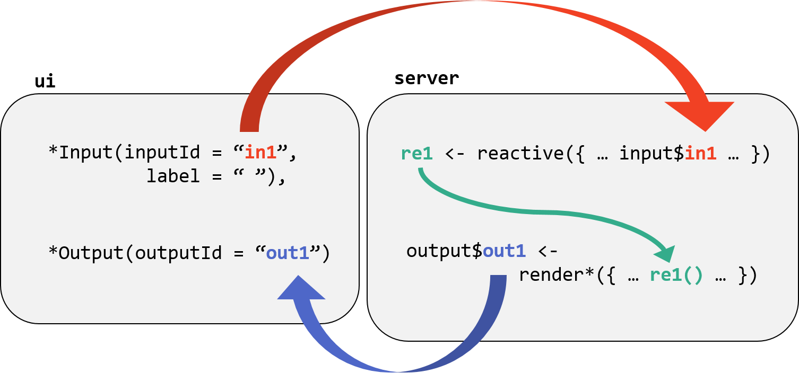

layout: true

<div class="my-footer">
  <span style="text-align:center">
    <span> 
      
    </span>
    <a href="https://therbootcamp.github.io/">
      <span style="padding-left:82px"> 
        <font color="#7E7E7E">
          www.therbootcamp.com
        </font>
      </span>
    </a>
    <a href="https://therbootcamp.github.io/">
      <font color="#7E7E7E">
       Reporting mit R | Juni 2020
      </font>
    </a>
    </span>
  </div> 

---

```{r setup, include=FALSE}
options(htmltools.dir.version = FALSE)
options(width = 110)
options(digits = 4)

# Load packages
require(tidyverse)

# load color set
source("../../_materials/palette/therbootcamp_palettes.R")

# knitr options
knitr::opts_chunk$set(dpi = 300, echo = FALSE, warning = FALSE, fig.align = 'center', message= FALSE)

# special print function: avoid if possible
print2 <- function(x, nlines=10,...) {
   cat(head(capture.output(print(x,...)), nlines), sep="\n")}

```

# Dashboard aus dem letzten Practical

<p align = "center">
  <iframe src="https://therbootcamp.github.io/RmR_2020Jun/_sessions/DashboardsI/app/BerlinDashboard.html" width="100%%" height="450" style="border:none;">
</iframe><br>
  <font style="font-size:10px">from <a href="https://therbootcamp.github.io/">therbootcamp.com</a></font>
</p>


---

# Mehr Interaktivität? &#8594; <highm>shiny</highm>!

.pull-left4[

<ul>
  <li class="m1"><span>Bisherige Dashboards konnten Daten in Fenstern <high>anzeigen</high>. </span></li>
  <li class="m2"><span>Daten <high>filtern</high> oder Variablen <high>auswählen</high> war aber <high>nicht</high> möglich.
</span></li>
  <li class="m3"><span><highm>shiny</highm> ermöglicht genau diese Funktionalität.</span></li>
</ul>

]

.pull-right5[

<p align = "center">
  <br>
  <font style="font-size:10px">from <a href="rstudio.com">rstudio.com</a></font>
</p>


]


---

# Was ist <mono>shiny</mono>?

.pull-left4[

> Shiny is an R package that makes it easy to build interactive web applications (apps) straight from R. - RStudio

<ul>
  <li class="m1"><span>Mit Shiny erstellt <high>interaktive Webseiten/Applikationen</high> erstellen.</span></li>  
  <li class="m1"><span>Interaktive Applikationen bieten höchste <high>Flexibilität</high>.</span></li>  
  <li class="m2"><span>Simple bis moderat komplexe Applikationen basieren auf <high>R und RMarkdown</high>.</span></li>
</ul>

]

.pull-right5[

<p align = "center">
  
</p>


]

---

# Beispiele

<p align = "center">
  <iframe src="https://vnijs.shinyapps.io/radiant" width="100%%" height="450" style="border:none;">
</iframe><br>
  <font style="font-size:10px">from <a href="https://vnijs.shinyapps.io/radiant">vnijs.shinyapps.io/radiant</a></font>
</p>

---

# Beispiele

<p align = "center">
  <iframe src="https://vac-lshtm.shinyapps.io/ncov_tracker/" width="100%%" height="450" style="border:none;">
</iframe><br>
  <font style="font-size:10px">from <a href="https://vac-lshtm.shinyapps.io/ncov_tracker/">vac-lshtm.shinyapps.io/ncov_tracker</a></font>
</p>

---


# Anatomie einer <mono>shiny</mono> App

.pull-left4[

<ul>
  <li class="m1"><span>Zwei Teile: <high>UI</high> und <high>server</high></span></li>  
  <li class="m2"><span>Der UI-Teil beinhaltet die angezeigte <high>Webseite</high>.</span></li>
  <li class="m3"><span>Der Server-Teil ist für die <high>Umsetzung des Inputs</high> verantwortlich.</span></li>
</ul>

]

.pull-right5[

<p align = "center">
  <br>
  <font style="font-size:10px">from <a href="http://juliawrobel.com/tutorials/shiny_tutorial_nba.html">juliawrobel.com</a></font>
</p>


]

---

# Benutzer Eingaben

.pull-left4[

<ul>
  <li class="m1"><span>Eingaben über <high>widgets</high>:</span></li> 
    <ul class="level">
      <li><span>Slider.</li></span>
      <li><span>Checkboxen.</li></span>
      <li><span>Dropdown Menus.</li></span>
      <li><span>...</li></span>
    </ul>
  <li class="m2"><span>Eingabewerte werden in <highm>input</highm> gespeichert.</span></li>
    <ul class="level">
      <li><span>Werte werden bei neuer Eingabe <high>upgedatet</high>.</li></span>
      <li><span>Werte werden mit <highm>input$INPUT_ID</highm> angesteuert.</li></span>
      <li><span>Eingaben kontrollieren auf der <high>Serverseite</high> ausgeführte Aktionen.</li></span>
    </ul>
</ul>

]

.pull-right5[

<br>
<p align = "center">
  <br>
  <font style="font-size:10px">from <a href="https://deanattali.com/blog/building-shiny-apps-tutorial/">deanattali.com</a></font>
</p>


]

---

# Reaktivität

.pull-left4[

<ul>
  <li class="m1"><span><high>Reaktive Objekte</high> werden permanent getrackt.</span></li>  
  <li class="m2"><span>Objekte verändern sich, wenn sich die <high>Eingabe verändert</high>.</span></li>
  <li class="m3"><span><mono>input</mono> kann nur in <high>reaktiver Umwelt</high> gelesen werden.</span></li>
  <li class="m4"><span>Jeder <high>Codeblock</high>, in dem die Objekte verwendet werden, wird erneut <high>ausgeführt</high> wenn es eine Eingabe gibt.</span></li>
  <li class="m5"><span>Werden, wie eine <high>Funktion</high>, mit <high>Klammern angesteuert</high>.</span></li>
</ul>


]

.pull-right5[

<p align = "center">
  <br>
  <font style="font-size:10px">from <a href="https://cyberhelp.sesync.org/basic-Shiny-lesson/2016/07/26/">cyberhelp.sesync.org</a></font>
</p>


]

---


# <highm>renderXXX()</highm> Funktionen

.pull-left4[

<ul>
  <li class="m1"><span>Um Veränderungen durch <high>reaktive Objekte</high> zu ermöglichen, müssen die entsprechenden Outputs mit speziellen Funktionen <high>gerendert</high> werden.</span></li>  
  <li class="m2"><span>Verschiedene <highm>renderXXX()</highm> Funktionen existieren in <mono>shiny</mono>, z.B.:</span></li>
      <ul class="level">
      <li><span><mono>renderPlot()</mono></li></span>
      <li><span><mono>renderTable()</mono></li></span>
      <li><span><mono>renderText()</mono></li></span>
      <li><span>...</li></span>
    </ul>
  <li class="m3"><span>Viele Pakete bieten <high>eigene</high> render Funktionen, z.B. <mono>renderLeaflet()</mono> oder <mono>renderPlotly()</mono>.</span></li>
  <li class="m4"><span><highm>input$INPUT_ID</highm> kann direkt in render Funktionen verwendet werden.</span></li>
</ul>

]

.pull-right5[

<p align = "center">
  <br>
  <font style="font-size:10px">from <a href="https://cyberhelp.sesync.org/basic-Shiny-lesson/2016/07/26/">cyberhelp.sesync.org</a></font>
</p>


]

---


# Verwende <highm>FUNKTION({...})</highm>

.pull-left4[

<ul>
  <li class="m1"><span>Verwende <highm>{}</highm> um mehrere <high>unabhängige</high> Statements in einer <mono>reactive()</mono> oder <mono>renderXXX()</mono> Funktion.</span></li>  
  <li class="m2"><span>Statements in <highm>{}</highm> werden als <high>Block</high> ausgeführt und nur das <high>letzte Statement</high> wird zurückgegeben (kreierte Objekte werden aber gespeichert).</span></li>  
</ul>


]

.pull-right5[

```{r eval = FALSE, echo = TRUE}
# Beispiel mehrere Statements in renderPlot()
renderPlot({
  n_colors <- length(unique(basel$bildung))
  farben <- viridis(n_colors)
  
  ggplot(...) +
    geom_point() +
    scale_color_manual(values = farben)
  
})
```


```{r echo = TRUE}
{
  a <- 1
  a
  a + 2
}
```


]

---


# Beispiel

.pull-left4[

<ul>
  <li class="m1"><span>Input definiert <high>Merkmal</high>.</span></li> 
  <li class="m2"><span>Reaktiver Datensatz, <high>gefiltert</high> nach Input.</span></li> 
  <li class="m3"><span>Verwendung des reaktiven Datensatzes in <high>Plot</high></span></li> 
</ul>

]

.pull-right5[

```{r eval = FALSE, echo = TRUE}
# Widget für User Input
checkboxGroupInput("MERKMAL", "TITEL", ...)

# Reaktive Daten generieren
DATEN_REAKTIV <- reactive({
  DATEN %>% 
    filter(VARIABLE %in% input$MERKMAL)
})

# Verwende Reaktive Daten mit Klammern
# Plot 1
renderPlot({
  DATEN_REAKTIV() %>% 
    ggplot(aes(...)) +
    geom_point()
})

# Plot 2
renderPlot({
  DATEN_REAKTIV() %>% 
    ggplot(aes(...)) +
    geom_histogram()
})
```


]

---

# <mono>shiny</mono>-Apps - Verschiedene Ansätze

.pull-left4[

<ul>
  <li class="m1"><span><mono>shiny</mono></span></li>  
    <ul class="level">
      <li><span>Pro: Volle Flexibilität.</li></span>
      <li><span>Contra: Hohe Komplexität.</li></span>
    </ul>
  <li class="m2"><span><mono>shinydasboard</mono></span></li>
    <ul class="level">
      <li><span>Pro: Niedrigere Komplexität.</li></span>
      <li><span>Contra: Weniger Flexibilität.</li></span>
    </ul>
  <li class="m3"><span><highm>flexdashboard</highm></span></li>
    <ul class="level">
      <li><span>Pro: Sehr einfach, da Ausbau von Markdown.</li></span>
      <li><span>Contra: Niedrige Flexibilität.</li></span>
    </ul>
</ul>

]

.pull-right5[

<p align = "center">
  <br>
  <font style="font-size:10px">from <a href="www.benfoolery.com/">benfoolery.com</a></font>
</p>


]

---

class: middle, center

<h1><a href="https://therbootcamp.github.io/RmR_2020Jun/_sessions/DashboardsII/DashboardsII_practical.html">Practical</a></h1>

