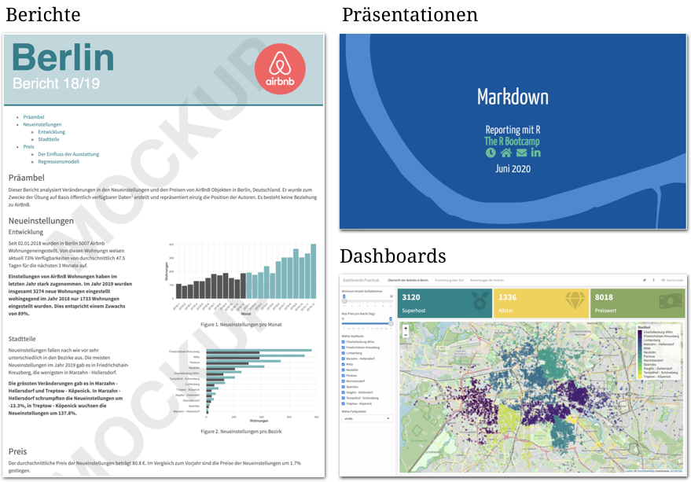

layout: true

<div class="my-footer">
  <span style="text-align:center">
    <span> 
      
    </span>
    <a href="https://therbootcamp.github.io/">
      <span style="padding-left:82px"> 
        <font color="#7E7E7E">
          www.therbootcamp.com
        </font>
      </span>
    </a>
    <a href="https://therbootcamp.github.io/">
      <font color="#7E7E7E">
       Reporting mit R | Juni 2020
      </font>
    </a>
    </span>
  </div> 

---

```{r setup, include=FALSE}
options(htmltools.dir.version = FALSE)
options(width = 110)
options(digits = 4)

# Load packages
require(tidyverse)
library(leaflet)
library(plotly)

# load color set
source("../../_materials/palette/therbootcamp_palettes.R")

# knitr options
knitr::opts_chunk$set(dpi = 300, echo = FALSE, warning = FALSE, fig.align = 'center', message= FALSE)

# special print function: avoid if possible
print2 <- function(x, nlines=10,...) {
   cat(head(capture.output(print(x,...)), nlines), sep="\n")}

basel <- read.csv("1_Data/basel.csv")

```

# Was ist Markdown?

.pull-left4[

<ul>
  <li class="m1"><span>Entwickelt von John Gruber and Aaron Swartz in 2004.<br><br>
  "<high>easy-to-read</high> and <high>easy-to-write</high> plain text format, [...] convert it to structurally valid XHTML (or HTML)"</span></li> 
  <li class="m2"><span>Einfache <high>Syntax für die Gestaltung</high> von Dokumenten.</span></li>  
  <ul>
    <li><span>Text in fett und kursiv</span></li>   
    <li><span>Listen</span></li>  
    <li><span>Überschriften</span></li> 
    <li><span>Links</span></li>
    <li><span>Bilder</span></li>
  </ul>
</ul>

]

.pull-right5[

<br>

<p align = "center">
  <br>
  <font style="font-size:10px">from <a href="https://de.wikipedia.org/wiki/Markdown">wikipedia.org</a></font>
</p>

]

---

# Was ist R Markdown?

.pull-left4[

<ul>
  <li class="m1"><span>Verwendet Markdown zum <high>Gestalten dynamischer Dokumente</high> mit eingebetteten...</span></li> 
  <ul><br>
    <li><span>R code chunks</span></li>
    <li><span>R in-line code</span></li>   
    <li><span>Statistischen Outputs</span></li>
    <li><span>Tabellen</span></li>
    <li><span>Visualisierungen</span></li>
  </ul>
</ul>

]

.pull-right5[

<p align = "center">
  <br>
  <font style="font-size:10px">from <a href="https://rmarkdown.rstudio.com/docs/">rmarkdown.rstudio.com</a></font>
</p>

]

---

.pull-left3[

# Arten des Berichts

slides

]

.pull-right6[

<br><br><br>
<p align = "center">
  
</p>

]

---

# Pipeline

.pull-left4[

slides

]

.pull-right5[

<p align = "center">
  
</p>

]

---

# Pipeline

.pull-left4[

slides

]

.pull-right5[

<p align = "center">
  
</p>

]

---

# R Markdown

.pull-left4[

slides

]

.pull-right5[

<p align = "center">
  
</p>

]


---

class: middle, center

<h1><a href="https://therbootcamp.github.io/RmR_2020Jun/_sessions/Markdown/Markdown_practical.html">Practical</a></h1>

