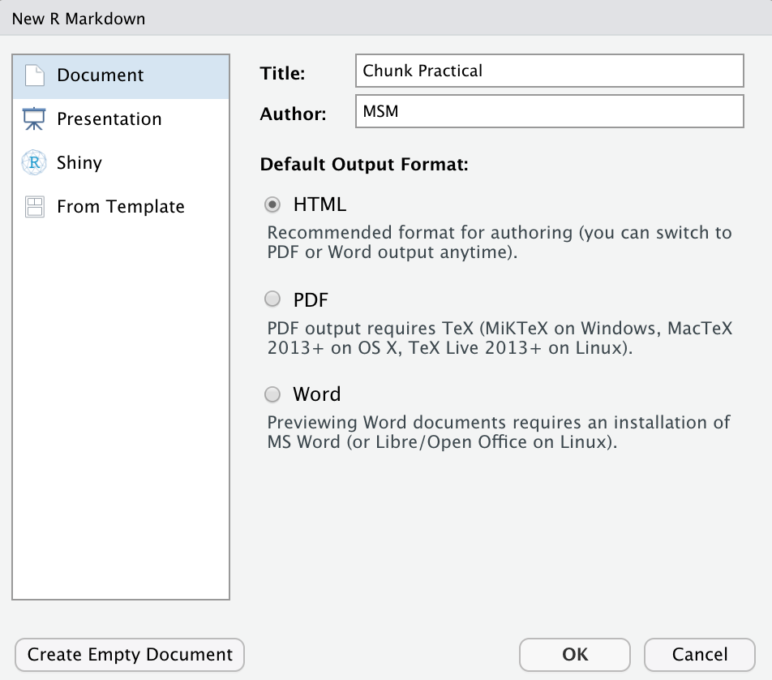

```{r setup, echo = FALSE, message = FALSE, warning = FALSE}
knitr::opts_chunk$set(comment = NA, 
                      fig.width = 6, 
                      fig.height = 6,
                      fig.align = 'center',
                      echo = FALSE, 
                      eval = FALSE, 
                      warning = FALSE)

options(digits = 3)

# Load packages
library(tidyverse)
library(knitr)
library(kableExtra)
```

<p align="center" width="100%">
  
  <br>
  <font style="font-size:10px">from <a href="">www.nestle.com</a></font>
</p>
 

# {.tabset}

## Überblick

In diesem Practical wirst Du verschiedene Chunk Einstellungen mit dem AirBnB Datensatz üben. 

Am Ende des Practicals kannst du:

1. Chunks nach deinen Wünschen konfigurieren
2. Verschiedene Arten von Inhaltsverzeichnissen erstellen 
3. Tabellen erstellen und gestalten

## Aufgaben

### A - Setup

1. Öffne dein `TheRBootcamp` R Projekt. Es sollte die Ordner `1_Data` und `2_Code` enthalten. Stelle sicher, dass du alle Datensätze, welche im `Datensätze` Tab aufgelistet sind, in deinem `1_Data` Ordner hast. 

2. Öffne ein neues RMarkdown Skript und wähle das Template "Document" aus (siehe screenshot unten).

<p align="center" width="100%">
  
</p>

3. Trage bei Title "Chunk Pactical" und deinen Namen ein.

4. Speichere das neue Skript unter dem Namen `markdown2_practical.Rmd` im `2_Code` Ordner.

5. Lösche alles unterhalb des `setup` R chunks.


### B - Lade den `airbnb` Datensatz

1. Wir wollen ein Inhaltsverzeichnis angezeigt bekommen. Im YAML header müssen  
wir also die Option toc auf TRUE setzen

````Markdown
output:
  html_document:
    toc: XXX
````

2. Füge im `setup` chunk die libraries `tidyverse()` und `kableExtra()` ein

````Markdown
{r setup, include=FALSE}
knitr::opts_chunk$set(echo = TRUE)
library(XXX)
library(XXX)
````

3. Lade den Datensatz `airbnb.csv` als Objekt `airbnb` im `setup` chunk aus dem Ordner 1_Data.

````Markdown
{r setup, include=FALSE}
knitr::opts_chunk$set(echo = TRUE)
airbnb <- read_csv("../XXX/XXX")
````


4. Erstelle einen neuen Chunk und zeige mit Hilfe der `summary()` Funktion eine Zusammenfassung des `airbnb` Datensatzes an. Es soll die Funktion und das Output angezeigt werden!
````Markdown
{r}
summary(XXX)
````

### C - Die richtige Wohnung finden

1. Wir wollen nun herausfinden welche Wohnung eine Kaffeemaschine, einen Geschirrspüler und Wifi hat (alles was man zum Leben braucht). Dafür wählen wir zuerst die drei Variablen aus (Kaffeemaschine, Geschirrspüler, Wifi).
````Markdown
{r}
XXX %>%
  select(XXX, XXX, XXX)
````

2. Jetzt erstellen wir eine neue Variable `hat_alles` in der wir die drei Variablen addieren.
````Markdown
{r}
XXX %>%
  select(XXX, XXX, XXX) %>%
  mutate(hat_alles = Kaffeemaschine + Geschirrspüler + Wifi)
````

3. Schiesslich wollen wir nur das Ergebnis im HTML file sehen (ohne Code)
````Markdown
{r echo = XXX}
XXX %>%
  select(XXX, XXX, XXX) %>%
  mutate(hat_alles = XXX + XXX + XXX)
````

4. Wieviele Wohnungen mit allen 3 Annehmlichkeiten gibt es? Code und Ergebnisse anzeigen!
````Markdown
{r echo = XXX}
XXX %>%
  select(XXX, XXX, XXX) %>%
  mutate(hat_alles = XXX + XXX + XXX) %>%
  count(hat_alles)
````

5. Nun wollen wir noch die Darstellung verbessern. Dazu speichern wir unseren dataframe 
zuerst in ein neues Objekt `vorhanden` ab. Dann schicken wir dieses Objekt in die Funktion
kable()

````Markdown
{r echo = XXX}
vorhanden <- 
XXX %>%
  select(XXX, XXX, XXX) %>%
  mutate(hat_alles = XXX + XXX + XXX) %>%
  count(hat_alles)
  
kable(vorhanden)  
````

6. Im nächsten Schritt werden wir die Namen der Spalten von `hat_alles` und `n` in 
etwas sinnvollerers ändern. Die Spalten sollen neu: `Kriterium` und `Anzahl` heissen.
 
````Markdown
kable(vorhanden,
      col.names = c('XXX', 'XXX'),
      ) %>%
kable_styling(full_width = F, font_size = 20)
````

7. Dann noch die Breite der Tabelle reduzieren und die Schriftgrösse erhöhen - hier
ist `kable_styling` hilfreich.
 
````Markdown
kable(vorhanden,
      col.names = c('XXX', 'XXX'),
      ) %>%
kable_styling(full_width = XXX, font_size = XXX)
````

## Beispiele

```{r, eval = FALSE, echo = TRUE}
library(tidyverse) 
library(cstab)
library(dbscan)
library(mclust, mask.ok = F)

# Beispieldatensatz
data(mpg)

# Verarbeitung des Datensatzes
mpg <- mpg %>% select_if(is.numeric)
mpg_stand <- mpg  %>% 
  scale %>%         # Standardisieren
  as_tibble()

# k-means -----

# Finde Cluster
mpg_km <- kmeans(mpg_stand, 
                 centers = 3)

# Zeige Zentroide
mpg_km$centers

# k-selection -----

# Zeige Binnenvarianz Verlauf
km_verlauf <- purrr::map(2:20, kmeans, x = mpg_stand)
binnenvarianz <- purrr::map_dbl(km_verlauf, 
                               `[[`, i = 'tot.withinss')

# Plotte die Binnenvarianz
plot(binnenvarianz)

# Gap & Slope Statistik
k_est <- cDistance(as.matrix(mpg_stand), 
                   kseq = 2:20) 
k_est$k__Gap
k_est$k_Slope

# Cluster stability
k_est <- cStability(as.matrix(mpg_stand), 
                    kseq = 2:20) 
k_est$k_instab
  
# DBSCAN -----

# Finde Cluster
mpg_dbscan <- dbscan(mpg_stand, eps = 1)

# Zeige Zentroide
mpg %>% 
  mutate(cl = mpg_dbscan$cluster) %>%
  group_by(cl) %>% 
  summarize_all(mean)

# Gaussian Mixtures -----

# Finde Cluster
mpg_gm <- Mclust(mpg)

# Zeige Zentroide
mpg %>% 
  mutate(cl = mpg_gm$classification) %>%
  group_by(cl) %>% 
  summarize_all(mean)

# Plotte Cluster
plot(mpg_gm, what = 'classification')

# Vergleiche Cluster -----

table(mpg_km$cluster, mpg_dbscan$cluster)
table(mpg_km$cluster, mpg_gm$classification)
table(mpg_dbscan$cluster, mpg_gm$classification)

```


## Datensätze

|Datei | Zeilen | Spalten | 
|:----|:-----|:------|
|[airbnb.csv](https://raw.githubusercontent.com/therbootcamp/RmR_2020Jun/master/_sessions/Markdown2/1_Data/airbnb.csv | 9868 | 33 | 

#### airbnb.csv

Der `airbnb` .... XXX Datensatz ist ein Ausschnitt des Öffentlich verfügbaren [*Credit Card Dataset*](https://www.kaggle.com/arjunbhasin2013/ccdata). Der Datensatz beinhaltet 8 Features, die einen Auschnitt des Verhaltens von 8636 Kreditkartenkunden beschreiben.  

|Variable | Beschreibung |
|:-------------|:-------------------------------------|
|BALANCE| Verfügbares Guthaben  |
|BALANCE_FREQUENCY| Änderungsfrequenz des Guthabens (1 = häufig, 0 = selten) |
|PURCHASES| Summe der Einkäufe |
|CREDITLIMIT| Kreditlimit der Karte |
|ONEOFFPURCHASES| Betrag der grössten einmaligen Zahlung |
|MINIMUM_PAYMENTS| Minimale Konto-Ausgleichszahlung  |
|PRCFULLPAYMENT| Prozent vollständige Konto-Ausgleichszahlung  |
|TENURE| Dauer des Kundenverhältnisses   |


## Funktionen

### Paket

|Paket| Installation|
|:------|:------|
|`tidyverse`|`install.packages("tidyverse")`|

### Funktionen

*Clustering*

| Funktion| Paket | Beschreibung |
|:---|:------|:---------------------------------------------|
| `kmeans()`|`stats`| Clustere die Daten mit *k*-means | 
| `dbscan()`|`dbscan`| Clustere die Daten mit DBSCAN | 
| `Mclust()`|`mclust`| Clustere die Daten mit Gaussian Mixtures | 

*k-selection*

| Funktion| Paket | Beschreibung |
|:---|:------|:---------------------------------------------|
| `cDistance()`|`cstab`| Identifiziere *k* mit distanzbasierten Methoden, z.B., der Gap Statistik.  | 
| `cStability()`|`cstab`| Identifiziere *k* mit stabilitätsbasierten Methoden. | 


## Materialien

### Dokumentation

- Eine gutes [**Tutorial**](https://www.r-bloggers.com/the-complete-guide-to-clustering-analysis-k-means-and-hierarchical-clustering-by-hand-and-in-r/) über *k*-means und hierarchisches Clustering.
