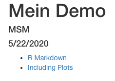
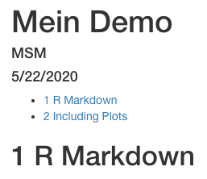
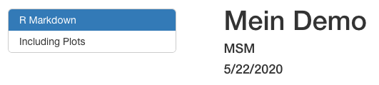

layout: true

<div class="my-footer">
  <span style="text-align:center">
    <span> 
      
    </span>
    <a href="https://therbootcamp.github.io/">
      <span style="padding-left:82px"> 
        <font color="#7E7E7E">
          www.therbootcamp.com
        </font>
      </span>
    </a>
    <a href="https://therbootcamp.github.io/">
      <font color="#7E7E7E">
       Reporting mit R | Juni 2020
      </font>
    </a>
    </span>
  </div> 

---

```{r setup, include=FALSE}
options(htmltools.dir.version = FALSE)
options(width = 110)
options(digits = 4)

# Load packages
require(tidyverse)
require(knitr)
require(stargazer)

# load color set
source("../../_materials/palette/therbootcamp_palettes.R")

# knitr options
knitr::opts_chunk$set(dpi = 300, echo = FALSE, warning = FALSE, fig.align = 'center', message= FALSE)

# special print function: avoid if possible
print2 <- function(x, nlines=10,...) {
   cat(head(capture.output(print(x,...)), nlines), sep="\n")}

# load data
airbnb <- read_csv("1_Data/airbnb.csv")

```

# Was sind die Eigenschaften der Wohnungen?

.pull-left4[
<ul>
  <li class="m1"><span>Im ersten Schritt wollen wir verschiedene Wege betrachten, wie wir unseren Datensatz in einem Markdown Dokument  darstellen können. Dafür werden wir  <highm>chunk</highm> Optionen verwenden</span></li>
  <li class="m2"><span><highm>Tabellen</highm> bieten uns dann eine einfache Möglichkeit Überblick über die Eigenschaften der Wohnung in unserem Datensatz zu erhatlten</span></li> 

</ul>
]

.pull-righ5[
]
---

# Feinheiten in den Chunk Einstellungen 

.pull-left4[
<ul>
  <li class="m1"><span> <highm>include = FALSE</highm>: Berechnungen im Hintergrund durchführen Code und Ergebnisse werde nicht angezeigt</span></li>  
</ul>

```{r eval = FALSE, echo = TRUE}
{r include = FALSE}
airbnb <- read_csv("1_Data/airbnb.csv")
```

]

.pull-righ5[

Daten können dann im nächsten Chunk abgefragt werden: 

```{r eval = TRUE}
head(airbnb)
```
]

---

# Feinheiten in den Chunk Einstellungen 

.pull-left4[
<ul>
  <li class="m1"><span><highm> include = FALSE</highm>: Berechnungen im Hintergrund durchführen Code und Ergebnisse werde nicht angezeigt</span></li> 
  <li class="m2"><span><highm>echo = FALSE</highm>: Code wird nicht angezeigt, Ergebnisse werden gezeigt </span></li>
</ul>

```{r eval = FALSE, echo = TRUE}
{r echo = FALSE}
select(airbnb, Preis)
```
]

.pull-righ5[


```{r echo = FALSE}
select(airbnb, Preis)
```

]

---

# Feinheiten in den Chunk Einstellungen 

.pull-left4[
<ul>
  <li class="m1"><span><highm> include = FALSE</highm>: Berechnungen im Hintergrund durchführen Code und Ergebnisse werde nicht angezeigt</span></li> 
  <li class="m2"><span><highm>echo = FALSE</highm>: Code wird nicht angezeigt, Ergebnisse werden gezeigt </span></li>
  <li class="m3"><span><highm>message = FALSE</highm></span></li>
</ul>

```{r eval = FALSE, echo = TRUE}
{r message = FALSE}
message('helloooo!')
```

]

.pull-righ5[

Message: TRUE
```{r message = TRUE}
message('helloooo!')
```

Message: FALSE

```{r message = FALSE}
message('helloooo!')
```
]

---

# Feinheiten in den Chunk Einstellungen 

.pull-left4[
<ul>
  <li class="m1"><span> <highm>include = FALSE</highm>: Berechnungen im Hintergrund durchführen Code und Ergebnisse werde nicht angezeigt</span></li> 
  <li class="m2"><span><highm>echo = FALSE</highm>: Code wird nicht angezeigt, Ergebnisse werden gezeigt </span></li>
  <li class="m3"><span><highm>message = FALSE</highm></span></li>
  <li class="m4"><span><highm>fig.cap = '...' </highm>Abbilungsunterschrift hinzufügen</span>, <highm>fig.width </highm>= '...', <highm>fig.height</highm> = '...'</li>
</ul>


]

.pull-righ5[

```{r fig.cap = 'Caption: AirBnB Preis', fig.width = 2, fig.height = 1.5}
ggplot(airbnb, aes(Erstellungsdatum, Preis)) +
  geom_point(size = .001) + 
  theme_bw()
```
]


---

# Inhaltsverzeichnis  

.pull-left4[
<ul>
  <li class="m1"><span>Inhaltsverzeichnis anzeigen <highm>toc: true</highm> und die 'Tiefe' erhöhen <highm>toc_depth: 2</highm></li>
</ul>

````markdown
title: "Mein Demo"
author: "MSM"
date: "5/22/2020"
output:
  html_document:
    toc: true
    toc_depth: 2
```` 

]

.pull-righ5[

<p align="center" width="100%">
  
  
</p>
]

---

# Inhaltsverzeichnis  

.pull-left4[
<ul>
  <li class="m1"><span>Inhaltsverzeichnis anzeigen <highm>toc: true</highm> und die 'Tiefe' erhöhen <highm>toc_depth: 2</highm></li>
 <li class="m2"><span> Überschirten werden mit <highm>number_sections: true</highm> numeriert</span></li>
</ul>

````markdown
title: "Meine erste Präsentation"
author: "MSM"
date: "5/19/2020"
output:
  html_document:
    toc: true
     number_sections: true
```` 

]

.pull-righ5[
<p align="center" width="100%">
  
</p>

]

---

# Inhaltsverzeichnis  

.pull-left4[

<ul>
  <li class="m1"><span>Inhaltsverzeichnis anzeigen <highm>toc: true</highm> und die 'Tiefe' erhöhen <highm>toc_depth: 2</highm></li>
 <li class="m2"><span> Überschirten werden mit <highm>number_sections: true</highm> numeriert</span></li>
  <li class="m3"> <span> Um das Inhaltsverzeichnis immer anzuzeigen kann die Option <highm>toc_float: true</highm> eingefügt werden</span></li>

</ul>


````markdown
title: "Mein Demo"
author: "MSM"
date: "5/22/2020"
output:
  html_document:
    toc: true
    toc_float: true
```` 

]

.pull-righ5[

<p align="center" width="100%">
  
</p>
]

---

# Tabellen

.pull-left4[

Tabellen können mit einfach mit <highm>table()</highm> angezeigt werden- sind dann allerdings nicht schön formatiert ... 

```{r eval = FALSE, echo = TRUE}
table(select(airbnb, Preis) %>% 
        slice(1:5))
```

]

.pull-righ5[

```{r}
table(select(airbnb, Preis) %>% slice(1:5))
```

]

---

# Tabellen

.pull-left4[
Schönere Darstellung ist mit <highm>kable()</highm> möglich ... 

```{r eval = FALSE, echo = TRUE}
kable(select(airbnb, Preis) %>% 
            slice(1:5),  
      col.names = "Preis")
```
]

.pull-righ5[

```{r}
kable(select(airbnb, Preis) %>% slice(1:5),  col.names = "Preis")
```

]

---

# Welche Faktoren bestimmen den Preis?

.pull-left4[

```{r eval = FALSE, echo = TRUE}
model <- lm(Preis ~ Schlafzimmer + Badezimmer + Rating_gesamt, data = airbnb)
summary(model)
```
]

.pull-righ5[
```{r results = 'asis'}
stargazer(model, header=FALSE, type="html")
```

]

---


class: middle, center

<h1><a href="https://therbootcamp.github.io/SmR_2020Jun/_sessions/_template/LinearModelsI_practical.html">Practical</a></h1>

