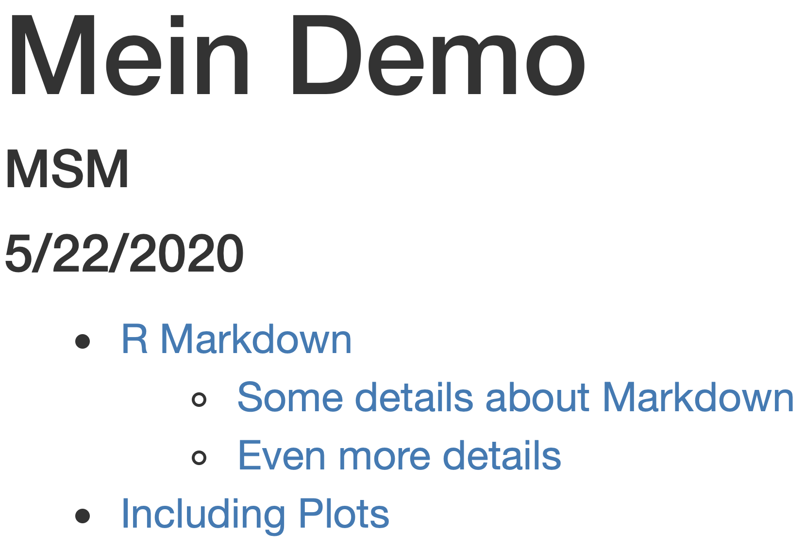
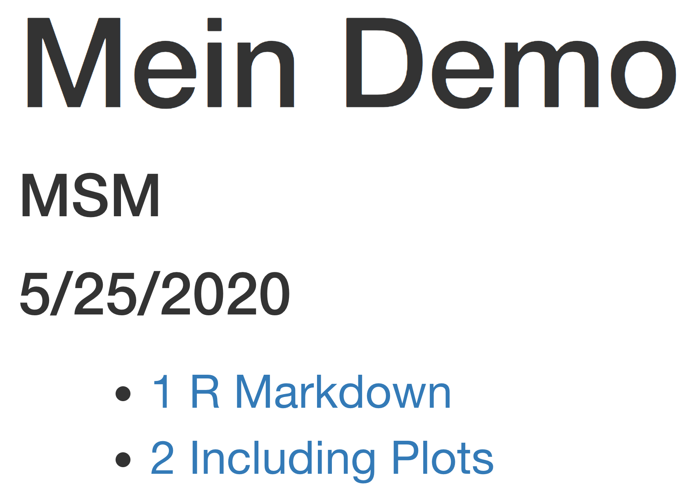
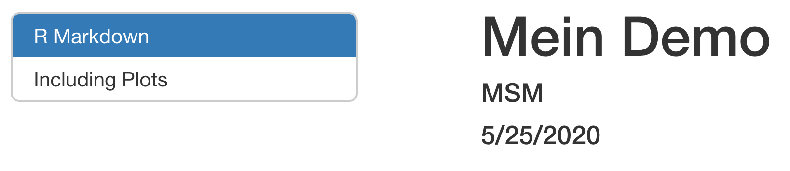

layout: true

<div class="my-footer">
  <span style="text-align:center">
    <span> 
      
    </span>
    <a href="https://therbootcamp.github.io/">
      <span style="padding-left:82px"> 
        <font color="#7E7E7E">
          www.therbootcamp.com
        </font>
      </span>
    </a>
    <a href="https://therbootcamp.github.io/">
      <font color="#7E7E7E">
       Reporting mit R | Juni 2020
      </font>
    </a>
    </span>
  </div> 

---

```{r setup, include=FALSE}
options(htmltools.dir.version = FALSE)
options(width = 110)
options(digits = 4)

# Load packages
require(tidyverse)
require(knitr)
require(stargazer)

# load color set
source("../../_materials/palette/therbootcamp_palettes.R")

# knitr options
knitr::opts_chunk$set(dpi = 300, 
                      echo = FALSE, 
                      warning = FALSE, 
                      fig.align = 'center', 
                      message= FALSE,
                      comment = NA)
# special print function: avoid if possible
print2 <- function(x, nlines=10,...) {
   cat(head(capture.output(print(x,...)), nlines), sep="\n")}

# load data
airbnb <- read_csv("1_Data/airbnb.csv")

```

# Was sind die Eigenschaften der Wohnungen?

In diesem Abschnitt wollen wir etwas mehr über die Wohnungen rausfinden.

Dazu werden wir die Einstellungen der chunks genauer betrachten und dann Tabellen erstellen.

---

# Chunks und Tabellen

.pull-left4[
<ul>
  <li class="m1"><span>Welche chunk Optionen gibt es?</span></li>
  <li class="m2"><span>Tabellen </span></li> 

</ul>
]

.pull-right5[
]

---

# Feinheiten in den Chunk Einstellungen 

.pull-left4[
<ul>
  <li class="m1"><span> Ohne zusätzliche Chunk Angaben werden Code und Ergebnisse angezeigt</span></li>  
</ul>

```{r eval = FALSE, echo = TRUE}
{r}
airbnb <- 
  read_csv("1_Data/airbnb.csv")
airbnb
```

]

.pull-right5[

```{r eval = TRUE, echo = TRUE}
airbnb <- 
  read_csv("1_Data/airbnb.csv")
airbnb
```

]

---

# Feinheiten in den Chunk Einstellungen 

.pull-left4[
<ul>
  <li class="m1"><span> Ohne zusätzliche Chunk Angaben werden Code und Ergebnisse angezeigt</span></li>  
  <li class="m2"><span> <highm>include = FALSE:</highm> Code und Ergebnisse werde nicht angezeigt</span></li>  
</ul>

```{r eval = FALSE, echo = TRUE}
{r include = FALSE}
airbnb <- 
  read_csv("1_Data/airbnb.csv")
airbnb
```

Daten können im nächsten Chunk abgefragt werden! 

]

.pull-right5[

```{r echo = FALSE, eval = FALSE}
airbnb <- 
  read_csv("1_Data/airbnb.csv")
airbnb
```

]

---

# Feinheiten in den Chunk Einstellungen 

.pull-left4[
<ul>
  <li class="m1"><span> Ohne zusätzliche Chunk Angaben werden Code und Ergebnisse angezeigt</span></li>  
  <li class="m2"><span> <highm>include = FALSE:</highm> Code und Ergebnisse werde nicht angezeigt</span></li>  
  <li class="m3"><span><highm>echo = FALSE</highm>: Code wird nicht angezeigt, <high>Ergebnisse werden gezeigt</high> </span></li>
</ul>

```{r eval = FALSE, echo = TRUE}
{r echo = FALSE}
select(airbnb, Preis, Erstellungsdatum)
```
]

.pull-right5[


```{r eval = TRUE, echo = FALSE}
select(airbnb, Preis, Erstellungsdatum)
```

]

---

# Feinheiten in den Chunk Einstellungen 

.pull-left4[
<ul>
  <li class="m1"><span> Ohne zusätzliche Chunk Angaben werden Code und Ergebnisse angezeigt</span></li>  
  <li class="m2"><span> <highm>include = FALSE:</highm> Code und Ergebnisse werde nicht angezeigt</span></li>  
  <li class="m3"><span><highm>echo = FALSE</highm>: Code wird nicht angezeigt, <high>Ergebnisse werden gezeigt</high> </span></li>
  <li class="m4"><span><highm>message = FALSE:</highm> Warnungen unterdrücken</span></li>
</ul>

```{r eval = FALSE, echo = TRUE}
{r message = FALSE}
message('Alles erledigt!')
```

]

.pull-right5[

Message: TRUE
```{r message = TRUE}
message('Alles erledigt!')
```

Message: FALSE

```{r message = FALSE}
message('Alles erledigt!')
```
]

---

# Feinheiten in den Chunk Einstellungen 

.pull-left4[
<ul>
  <li class="m1"><span> Ohne zusätzliche Chunk Angaben werden Code und Ergebnisse angezeigt</span></li>  
  <li class="m2"><span> <highm>include = FALSE:</highm> Code und Ergebnisse werde nicht angezeigt</span></li>  
  <li class="m3"><span><highm>echo = FALSE</highm>: Code wird nicht angezeigt, <high>Ergebnisse werden gezeigt</high> </span></li>
  <li class="m4"><span><highm>message = FALSE:</highm> Warnungen unterdrücken</span></li>
  <li class="m5"><span><highm>fig.width </highm>= '...', <highm>fig.height</highm> = '...'</li>
</ul>

```{r eval = FALSE, echo = TRUE}
{r fig.width = 5, fig.height = 3}
ggplot(airbnb, 
aes(Erstellungsdatum, Preis)) +
geom_point() + 
theme_bw()
```


]

.pull-right5[

```{r fig.width = 5, fig.height = 3, dpi = 300}
ggplot(airbnb, 
aes(Erstellungsdatum, Preis)) +
geom_point() + 
theme_bw()
```
]


---

# Inhaltsverzeichnis  

.pull-left4[
<ul>
  <li class="m1"><span>Inhaltsverzeichnis anzeigen <high>toc: true</high> und die 'Tiefe' erhöhen <high>toc_depth: 2</high></li>
</ul>

````markdown
title: "Mein Demo"
author: "MSM"
date: "5/22/2020"
output:
  html_document:
    toc: true
    toc_depth: 2
```` 

]

.pull-right5[

<p align="center" width="100%">
  
</p>
]

---

# Inhaltsverzeichnis  

.pull-left4[
<ul>
  <li class="m1"><span>Inhaltsverzeichnis anzeigen <high>toc: true</high> und die 'Tiefe' erhöhen <high>toc_depth: 2</high></li>
 <li class="m2"><span> Überschriften werden mit <high>number_sections: true</high> numeriert</span></li>
</ul>

````markdown
title: "Meine erste Präsentation"
author: "MSM"
date: "5/19/2020"
output:
  html_document:
    toc: true
     number_sections: true
```` 

]

.pull-right5[
<p align="center" width="100%">
  
</p>

]

---

# Inhaltsverzeichnis  

.pull-left4[

<ul>
  <li class="m1"><span>Inhaltsverzeichnis anzeigen <high>toc: true</high> und die 'Tiefe' erhöhen <high>toc_depth: 2</high></li>
 <li class="m2"><span> Überschriften werden mit <high>number_sections: true</high> numeriert</span></li>
  <li class="m3"> <span>Inhaltsverzeichnis permament links anzeigen <high>toc_float: true</high></span></li>

</ul>

 
````markdown
title: "Mein Demo"
author: "MSM"
date: "5/22/2020"
output:
  html_document:
    toc: true
    toc_float: true
```` 

]

.pull-right5[

<p align="center" width="100%">
 
</p>
]

---

# Tabellen

.pull-left4[

Tabellen werden mit <highm>table()</highm> angezeigt - sind dann allerdings nicht schön formatiert ... 

```{r eval = FALSE, echo = TRUE}
df <- select(airbnb, Preis) %>% 
      slice(1:5)
        
table(df)
```

]

.pull-right5[

```{r eval = TRUE}
table(select(airbnb, Preis) %>% slice(1:5))
```

]

---

# Tabellen

.pull-left4[
Schönere Darstellung ist mit <high>kable()</high> möglich ... 

```{r eval = FALSE, echo = TRUE}
{r}
kable(select(airbnb, Preis) %>% 
            slice(1:5),  
      col.names = "Preis")
```
]

.pull-right5[

```{r}
kable(select(airbnb, Preis) %>% slice(1:5),  col.names = "Preis")
```

]

---

# Welche Faktoren bestimmen den Preis?

.pull-left4[

```{r eval = FALSE, echo = TRUE}
model <- lm(Preis ~ Schlafzimmer + Badezimmer + Rating_gesamt, data = airbnb)
summary(model)
```
```{r eval = TRUE, echo = FALSE}
model <- lm(Preis ~ Schlafzimmer + Badezimmer + Rating_gesamt, data = airbnb)
summary(model)
```
]

.pull-right5[
```{r results = 'asis'}
stargazer(model, header=FALSE, type="html")
```

]

---


class: middle, center

<h1><a href="https://therbootcamp.github.io/SmR_2020Jun/_sessions/_template/LinearModelsI_practical.html">Practical</a></h1>

