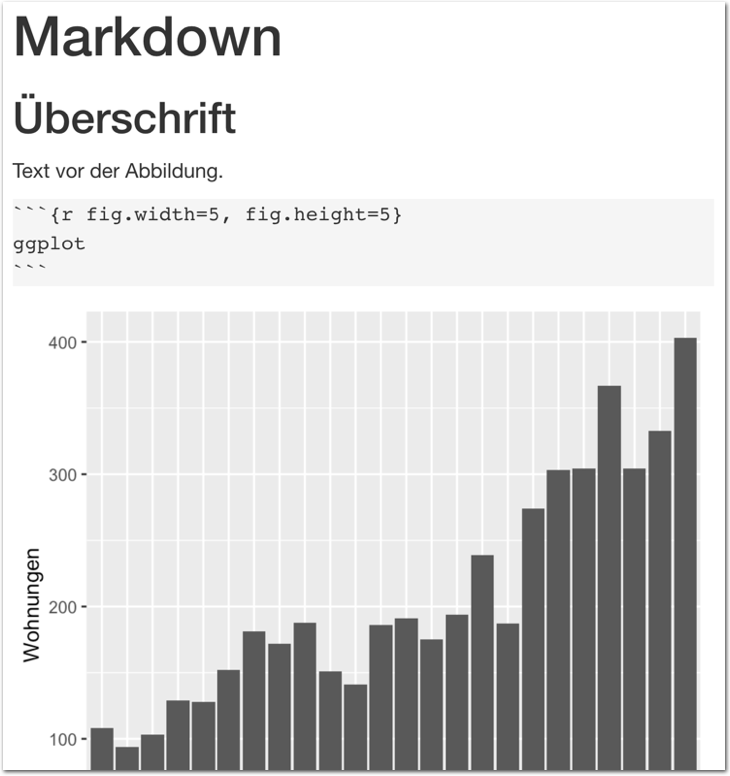

layout: true

<div class="my-footer">
  <span style="text-align:center">
    <span> 
      
    </span>
    <a href="https://therbootcamp.github.io/">
      <span style="padding-left:82px"> 
        <font color="#7E7E7E">
          www.therbootcamp.com
        </font>
      </span>
    </a>
    <a href="https://therbootcamp.github.io/">
      <font color="#7E7E7E">
       Reporting mit R | Juni 2020
      </font>
    </a>
    </span>
  </div> 

---

```{r setup, include=FALSE}
options(htmltools.dir.version = FALSE)
options(width = 110)
options(digits = 4)

# Load packages
require(tidyverse)
require(knitr)
require(kable)
require(kableExtra)
library(lubridate)
# load color set
source("../../_materials/palette/therbootcamp_palettes.R")

# knitr options
knitr::opts_chunk$set(echo = FALSE, 
                      warning = FALSE, 
                      message= FALSE,
                      comment = NA)
# special print function: avoid if possible
print2 <- function(x, nlines=10,...) {
   cat(head(capture.output(print(x,...)), nlines), sep="\n")}

# load data
airbnb_1819 <- read_csv('1_Data/airbnb.csv') %>% 
  filter(Erstellungsdatum > "2018-01-01", 
         Erstellungsdatum < "2019-12-31")

theme_set(theme_minimal())

cols = "https://www.colourlovers.com/palette/3498539/airbnb"

```

.pull-left3[

# Nächste Schritte

<ul>
  <li class="m1"><span>Abbildungen skalieren.</span></li>
  <li class="m2"><span>Tabellen</span></li>
  <li class="m3"><span>Fussnoten & Links</span></li>
</ul>

]

.pull-right6[

<p align = "center">
  
</p>

]

---

.pull-left4[

# Grafiken skalieren

<ul>
  <li class="m1"><span>Die <high>Darstellung</high> von Grafiken kann in den <mono>Chunk</mono>-Settings angpasst werden.</span></li> 
  <li class="m2"><span>Die Argumente beginnen (meist) mit <highm>fig.*</highm>.</span></li> 
</ul>

<table style="cellspacing:0; cellpadding:0; border:none; padding-top:10px" width=100%>
  <col width="40%">
  <col width="60%">
<tr>
  <td bgcolor="white">
    <b>Funktion</b>
  </td>
  <td bgcolor="white">
    <b>Beschreibung</b>
  </td> 
</tr>
<tr>
  <td bgcolor="white">
  <mono>fig.width</mono>, <mono>fig.height</mono>
  </td>
  <td bgcolor="white">
  <high>Breite</high> und <high>Höhe</high> in inches
  </td> 
</tr>
<tr>
  <td bgcolor="white">
  <mono>fig.asp</mono>
  </td>
  <td bgcolor="white">
   <high>Seitenverhältnis</high>: Höhe relativ zur Breite.   
  </td> 
</tr>
<tr>
  <td bgcolor="white">
  <mono>fig.align</mono>
  </td>
  <td bgcolor="white">
  <high>Position</high> der Abbildung: <mono>'center'</mono>, <mono>'left'</mono>, <mono>'right'</mono>
  </td> 
</tr>
<tr>
  <td bgcolor="white">
  <mono>dpi</mono> 
  </td>
  <td bgcolor="white">
  <high>Auflösung</high> der Abbildung (dots per inch)
  </td> 
</tr>
</table>
]

.pull-right5[
<br>
<p align = "center">
  
</p>

]

---

.pull-left4[

# Grafiken skalieren

<ul>
  <li class="m1"><span>Die <high>Darstellung</high> von Grafiken kann in den <mono>Chunk</mono>-Settings angpasst werden.</span></li> 
  <li class="m2"><span>Die Argumente beginnen (meist) mit <highm>fig.*</highm>.</span></li> 
</ul>

<table style="cellspacing:0; cellpadding:0; border:none; padding-top:10px" width=100%>
  <col width="40%">
  <col width="60%">
<tr>
  <td bgcolor="white">
    <b>Funktion</b>
  </td>
  <td bgcolor="white">
    <b>Beschreibung</b>
  </td> 
</tr>
<tr>
  <td bgcolor="white">
  <mono>fig.width</mono>, <mono>fig.height</mono>
  </td>
  <td bgcolor="white">
  <high>Breite</high> und <high>Höhe</high> in inches
  </td> 
</tr>
<tr>
  <td bgcolor="white">
  <mono>fig.asp</mono>
  </td>
  <td bgcolor="white">
   <high>Seitenverhältnis</high>: Höhe relativ zur Breite.   
  </td> 
</tr>
<tr>
  <td bgcolor="white">
  <mono>fig.align</mono>
  </td>
  <td bgcolor="white">
  <high>Position</high> der Abbildung: <mono>'center'</mono>, <mono>'left'</mono>, <mono>'right'</mono>
  </td> 
</tr>
<tr>
  <td bgcolor="white">
  <mono>dpi</mono> 
  </td>
  <td bgcolor="white">
  <high>Auflösung</high> der Abbildung (dots per inch)
  </td> 
</tr>
</table>
]

.pull-right5[
<br>
<p align = "center">
  
</p>

]

---

.pull-left4[

# Grafiken skalieren

<ul>
  <li class="m1"><span>Die <high>Darstellung</high> von Grafiken kann in den <mono>Chunk</mono>-Settings angpasst werden.</span></li> 
  <li class="m2"><span>Die Argumente beginnen (meist) mit <highm>fig.*</highm>.</span></li> 
</ul>

<table style="cellspacing:0; cellpadding:0; border:none; padding-top:10px" width=100%>
  <col width="40%">
  <col width="60%">
<tr>
  <td bgcolor="white">
    <b>Funktion</b>
  </td>
  <td bgcolor="white">
    <b>Beschreibung</b>
  </td> 
</tr>
<tr>
  <td bgcolor="white">
  <mono>fig.width</mono>, <mono>fig.height</mono>
  </td>
  <td bgcolor="white">
  <high>Breite</high> und <high>Höhe</high> in inches
  </td> 
</tr>
<tr>
  <td bgcolor="white">
  <mono>fig.asp</mono>
  </td>
  <td bgcolor="white">
   <high>Seitenverhältnis</high>: Höhe relativ zur Breite.   
  </td> 
</tr>
<tr>
  <td bgcolor="white">
  <mono>fig.align</mono>
  </td>
  <td bgcolor="white">
  <high>Position</high> der Abbildung: <mono>'center'</mono>, <mono>'left'</mono>, <mono>'right'</mono>
  </td> 
</tr>
<tr>
  <td bgcolor="white">
  <mono>dpi</mono> 
  </td>
  <td bgcolor="white">
  <high>Auflösung</high> der Abbildung (dots per inch)
  </td> 
</tr>
</table>
]

.pull-right5[
<br>
<p align = "center">
  
</p>

]

---

.pull-left4[

# Grafiken skalieren

<ul>
  <li class="m1"><span>Die <high>Darstellung</high> von Grafiken kann in den <mono>Chunk</mono>-Settings angpasst werden.</span></li> 
  <li class="m2"><span>Die Argumente beginnen (meist) mit <highm>fig.*</highm>.</span></li> 
</ul>

<table style="cellspacing:0; cellpadding:0; border:none; padding-top:10px" width=100%>
  <col width="40%">
  <col width="60%">
<tr>
  <td bgcolor="white">
    <b>Funktion</b>
  </td>
  <td bgcolor="white">
    <b>Beschreibung</b>
  </td> 
</tr>
<tr>
  <td bgcolor="white">
  <mono>fig.width</mono>, <mono>fig.height</mono>
  </td>
  <td bgcolor="white">
  <high>Breite</high> und <high>Höhe</high> in inches
  </td> 
</tr>
<tr>
  <td bgcolor="white">
  <mono>fig.asp</mono>
  </td>
  <td bgcolor="white">
   <high>Seitenverhältnis</high>: Höhe relativ zur Breite.   
  </td> 
</tr>
<tr>
  <td bgcolor="white">
  <mono>fig.align</mono>
  </td>
  <td bgcolor="white">
  <high>Position</high> der Abbildung: <mono>'center'</mono>, <mono>'left'</mono>, <mono>'right'</mono>
  </td> 
</tr>
<tr>
  <td bgcolor="white">
  <mono>dpi</mono> 
  </td>
  <td bgcolor="white">
  <high>Auflösung</high> der Abbildung (dots per inch)
  </td> 
</tr>
</table>
]

.pull-right5[
<br>
<p align = "center">
  
</p>

]

---

.pull-left4[

# Grafiken skalieren

<ul>
  <li class="m1"><span>Die <high>Darstellung</high> von Grafiken kann in den <mono>Chunk</mono>-Settings angpasst werden.</span></li> 
  <li class="m2"><span>Die Argumente beginnen (meist) mit <highm>fig.*</highm>.</span></li> 
</ul>

<table style="cellspacing:0; cellpadding:0; border:none; padding-top:10px" width=100%>
  <col width="40%">
  <col width="60%">
<tr>
  <td bgcolor="white">
    <b>Funktion</b>
  </td>
  <td bgcolor="white">
    <b>Beschreibung</b>
  </td> 
</tr>
<tr>
  <td bgcolor="white">
  <mono>fig.width</mono>, <mono>fig.height</mono>
  </td>
  <td bgcolor="white">
  <high>Breite</high> und <high>Höhe</high> in inches
  </td> 
</tr>
<tr>
  <td bgcolor="white">
  <mono>fig.asp</mono>
  </td>
  <td bgcolor="white">
   <high>Seitenverhältnis</high>: Höhe relativ zur Breite.   
  </td> 
</tr>
<tr>
  <td bgcolor="white">
  <mono>fig.align</mono>
  </td>
  <td bgcolor="white">
  <high>Position</high> der Abbildung: <mono>'center'</mono>, <mono>'left'</mono>, <mono>'right'</mono>
  </td> 
</tr>
<tr>
  <td bgcolor="white">
  <mono>dpi</mono> 
  </td>
  <td bgcolor="white">
  <high>Auflösung</high> der Abbildung (dots per inch)
  </td> 
</tr>
</table>
]

.pull-right5[
<br>
<p align = "center">
  
</p>

]


---

.pull-left4[

# Bildunterschrift

<ul>
  <li class="m1"><span>Bildunterschriften können durch <mono>fig.cap</mono> gesetzt.</span></li> 
  <li class="m2"><span>Der Text kann innherlab des Chunks definiert werden.</span></li> 
</ul>


]

.pull-right5[
<br>
<p align = "center">
  
</p>

]


---

# Tabellen

.pull-left4[

Die Standardausgabe eines Dataframes ist gut für die Konsole geeignet, aber weniger schön für einen Bericht.

Hier berechnen wir für jedes Ausstattungsmerkmal (vorhanden / nicht vorahnden) den Mittelwert des Preises.
]

.pull-right5[

```{r message = F, echo = F}
Ausstattung_var = c('Küche','Wifi','TV','Kaffeemaschine','Geschirrspüler','Terrasse_Balkon','Check_in_24h')

Ausstattung <- airbnb_1819 %>% 
  select(all_of(Ausstattung_var), Preis) %>%
  pivot_longer(-Preis,
             names_to = 'Ausstattung',
             values_to = 'Ausstattung_vorhanden') %>% 
  group_by(Ausstattung) %>% 
  summarize(Nicht_vorhanden = mean(Preis[!Ausstattung_vorhanden]),
            Vorhanden = mean(Preis[Ausstattung_vorhanden]),
            Differenz = Vorhanden - Nicht_vorhanden, 
            Prozent_vorhanden = mean(Ausstattung_vorhanden) * 100) %>% 
  arrange(desc(Differenz)) 
```

```{r}
airbnb_1819 %>% 
  select(all_of(Ausstattung_var), Preis) %>%
  pivot_longer(-Preis,
             names_to = 'Ausstattung',
             values_to = 'Ausstattung_vorhanden') %>% 
  group_by(Ausstattung) %>% 
  summarize(Nicht_vorhanden = mean(Preis[!Ausstattung_vorhanden]),
            Vorhanden = mean(Preis[Ausstattung_vorhanden]),
            Differenz = Vorhanden - Nicht_vorhanden, 
            Prozent_vorhanden = mean(Ausstattung_vorhanden) * 100) %>% 
  arrange(desc(Differenz)) 
```

]

---

# Tabellen

.pull-left4[

<ul>
  <li class="m1"><span>Der Befehl <mono>kable()</mono> hilft bei der  
  <high>Gestaltung</high> von <high>HTML Tabellen</high></span></li> 
  <li class="m2"><span><mono>kable()</mono> erwartet eine <high>Matrize</high> oder <high>Tabelle</high> als Eingabe</span></li> 
</ul>

<table style="cellspacing:0; cellpadding:0; border:none; padding-top:10px" width=100%>
  <col width="40%">
  <col width="60%">
<tr>
  <td bgcolor="white">
    <b>Funktion</b>
  </td>
  <td bgcolor="white">
    <b>Beschreibung</b>
  </td> 
</tr>
<tr>
  <td bgcolor="white">
  <mono>format</mono>
  </td>
  <td bgcolor="white">
  <high>Ausgabeformat</high> (<mono>'html', 'markdown', 'latex')</mono>
  </td> 
</tr>
<tr>
  <td bgcolor="white">
  <mono>col.names</mono>
  </td>
  <td bgcolor="white">
   <high>Spaltennamen</high> mit Vektor bestimmen   
  </td> 
</tr>

<tr>
  <td bgcolor="white">
  <mono>escape</mono> 
  </td>
  <td bgcolor="white">
  Ignoriert <high>spezielle Zeichen</high> wie \ oder $ 
  </td> 
</tr>
<tr>
  <td bgcolor="white">
  <mono>align</mono>
  </td>
  <td bgcolor="white">
  <high>Ausrichtung</high> der Spalten (<mono>'(c)enter'</mono>, <mono>'(l)eft'</mono>, <mono>'(r)ight'</mono>)
  </td> 
</tr>
</table>
]

.pull-right5[


```{r kable_format, echo = TRUE}
Ausstattung %>% kable(format = 'html')
```

]

---

# Tabellen

.pull-left4[

<ul>
  <li class="m1"><span>Der Befehl <mono>kable()</mono> hilft bei der  
  <high>Gestaltung</high> von <high>HTML Tabellen</high></span></li> 
  <li class="m2"><span><mono>kable()</mono> erwartet eine <high>Matrize</high> oder <high>Tabelle</high> als Eingabe</span></li> 
</ul>

<table style="cellspacing:0; cellpadding:0; border:none; padding-top:10px" width=100%>
  <col width="40%">
  <col width="60%">
<tr>
  <td bgcolor="white">
    <b>Funktion</b>
  </td>
  <td bgcolor="white">
    <b>Beschreibung</b>
  </td> 
</tr>
<tr>
  <td bgcolor="white">
  <mono>format</mono>
  </td>
  <td bgcolor="white">
  <high>Ausgabeformat</high> (<mono>'html', 'markdown', 'latex')</mono>
  </td> 
</tr>
<tr>
  <td bgcolor="white">
  <mono>col.names</mono>
  </td>
  <td bgcolor="white">
   <high>Spaltennamen</high> mit Vektor bestimmen   
  </td> 
</tr>
<tr>
  <td bgcolor="white">
  <mono>escape</mono> 
  </td>
  <td bgcolor="white">
  Ignoriert <high>spezielle Zeichen</high> wie \ oder $ 
  </td> 
</tr>
<tr>
  <td bgcolor="white">
  <mono>align</mono>
  </td>
  <td bgcolor="white">
  <high>Ausrichtung</high> der Spalten (<mono>'(c)enter'</mono>, <mono>'(l)eft'</mono>, <mono>'(r)ight'</mono>)
  </td> 
</tr>
</table>
]

.pull-right5[

```{r kable_col, echo = TRUE}
Ausstattung %>% kable(format = 'html',
col.names = c('', 'Preis<br>Nicht-vorh.', 
              'Preis<br>vorh.','Differenz',
              'Prozent<br>vorh.'))
```

]

---

# Tabellen

.pull-left4[

<ul>
  <li class="m1"><span>Der Befehl <mono>kable()</mono> hilft bei der  
  <high>Gestaltung</high> von <high>HTML Tabellen</high></span></li> 
  <li class="m2"><span><mono>kable()</mono> erwartet eine <high>Matrize</high> oder <high>Tabelle</high> als Eingabe</span></li> 
</ul>

<table style="cellspacing:0; cellpadding:0; border:none; padding-top:10px" width=100%>
  <col width="40%">
  <col width="60%">
<tr>
  <td bgcolor="white">
    <b>Funktion</b>
  </td>
  <td bgcolor="white">
    <b>Beschreibung</b>
  </td> 
</tr>
<tr>
  <td bgcolor="white">
  <mono>format</mono>
  </td>
  <td bgcolor="white">
  <high>Ausgabeformat</high> (<mono>'html', 'markdown', 'latex')</mono>
  </td> 
</tr>
<tr>
  <td bgcolor="white">
  <mono>col.names</mono>
  </td>
  <td bgcolor="white">
   <high>Spaltennamen</high> mit Vektor bestimmen   
  </td> 
</tr>
<tr>
  <td bgcolor="white">
  <mono>escape</mono> 
  </td>
  <td bgcolor="white">
  Ignoriert <high>spezielle Zeichen</high> wie \ oder $ 
  </td> 
</tr>
<tr>
  <td bgcolor="white">
  <mono>align</mono>
  </td>
  <td bgcolor="white">
  <high>Ausrichtung</high> der Spalten (<mono>'(c)enter'</mono>, <mono>'(l)eft'</mono>, <mono>'(r)ight'</mono>)
  </td> 
</tr>
</table>
]

.pull-right5[

```{r kable_escape, echo = TRUE}
Ausstattung %>% kable(format = 'html',
col.names = c('', 'Preis<br>Nicht-vorh.', 
              'Preis<br>vorh.','Differenz',
              'Prozent<br>vorh.'),
escape = FALSE)
```

]

---

# Tabellen

.pull-left4[

<ul>
  <li class="m1"><span>Der Befehl <mono>kable()</mono> hilft bei der  
  <high>Gestaltung</high> von <high>HTML Tabellen</high></span></li> 
  <li class="m2"><span><mono>kable()</mono> erwartet eine <high>Matrize</high> oder <high>Tabelle</high> als Eingabe</span></li> 
</ul>

<table style="cellspacing:0; cellpadding:0; border:none; padding-top:10px" width=100%>
  <col width="40%">
  <col width="60%">
<tr>
  <td bgcolor="white">
    <b>Funktion</b>
  </td>
  <td bgcolor="white">
    <b>Beschreibung</b>
  </td> 
</tr>
<tr>
  <td bgcolor="white">
  <mono>format</mono>
  </td>
  <td bgcolor="white">
  <high>Ausgabeformat</high> (<mono>'html', 'markdown', 'latex')</mono>
  </td> 
</tr>
<tr>
  <td bgcolor="white">
  <mono>col.names</mono>
  </td>
  <td bgcolor="white">
   <high>Spaltennamen</high> mit Vektor bestimmen   
  </td> 
</tr>
<tr>
  <td bgcolor="white">
  <mono>escape</mono> 
  </td>
  <td bgcolor="white">
  Ignoriert <high>spezielle Zeichen</high> wie \ oder $ 
  </td> 
</tr>
<tr>
  <td bgcolor="white">
  <mono>align</mono>
  </td>
  <td bgcolor="white">
  <high>Ausrichtung</high> der Spalten (<mono>'(c)enter'</mono>, <mono>'(l)eft'</mono>, <mono>'(r)ight'</mono>)
  </td> 
</tr>
</table>
]

.pull-right5[

```{r kable_align, echo = TRUE}
Ausstattung %>% kable(format = 'html',
col.names = c('', 'Preis<br>Nicht-vorh.', 
              'Preis<br>vorh.','Differenz',
              'Prozent<br>vorh.'),
escape = FALSE, align = 'lcccc')
```

]

---

# Tabellen

.pull-left4[

<ul>
  <li class="m1"><span>Zur <high>Verfeinerung</high> der Formatierung gibt es zusätzlicher Befehle</span></li>
  <li class="m2"><span><mono>cell_spec</mono> und <mono>column_spec</mono> werden vor- bzw nachgeschalten</span> </li>
</ul>

<table style="cellspacing:0; cellpadding:0; border:none; padding-top:10px" width=100%>
  <col width="40%">
  <col width="60%">
<tr>
  <td bgcolor="white">
    <b>Funktion</b>
  </td>
  <td bgcolor="white">
    <b>Beschreibung</b>
  </td> 
</tr>
<tr>
  <td bgcolor="white">
  <mono>caption</mono>
  </td>
  <td bgcolor="white">Einfügen eines <high>Grafiktitels</high>
  </td> 
</tr>
<tr>
  <td bgcolor="white">
  <mono>digits</mono>
  </td>
  <td bgcolor="white">
   <high>Anzahl</high> Nachkommastellen   
  </td> 
</tr>
<tr>
  <td bgcolor="white">
  <mono>cell_spec</mono> 
  </td>
  <td bgcolor="white">
  <high>Zellformatierung</high> gestalten (<mono>font_size</mono>)
  </td> 
</tr>
<tr>
  <td bgcolor="white">
  <mono>column_spec</mono>
  </td>
  <td bgcolor="white">
  <high>Spaltenformatierung</high> gestalten (<mono>background</mono>)
  </td> 
</tr>
</table>
]

.pull-right5[

```{r echo = TRUE, eval = FALSE}
...
caption = 'Tabelle 1. Ausstattung und 
Einfluss auf den Preis')
```

```{r kable_caption, echo = FALSE, eval = TRUE}
Ausstattung %>% kable(format = 'html',
col.names = c('', 'Preis<br>Nicht-vorh.', 
              'Preis<br>vorh.','Differenz',
              'Prozent<br>vorh.'),
escape = FALSE, align = 'lcccc',
caption = 'Tabelle 1. Ausstattung und Einfluss auf den Preis')
```

]

---

# Tabellen

.pull-left4[

<ul>
  <li class="m1"><span>Zur <high>Verfeinerung</high> der Formatierung gibt es zusätzlicher Befehle</span></li>
  <li class="m2"><span><mono>cell_spec</mono> und <mono>column_spec</mono> werden vor- bzw nachgeschalten</span> </li>
</ul>

<table style="cellspacing:0; cellpadding:0; border:none; padding-top:10px" width=100%>
  <col width="40%">
  <col width="60%">
<tr>
  <td bgcolor="white">
    <b>Funktion</b>
  </td>
  <td bgcolor="white">
    <b>Beschreibung</b>
  </td> 
</tr>
<tr>
  <td bgcolor="white">
  <mono>caption</mono>
  </td>
  <td bgcolor="white">Einfügen eines <high>Grafiktitels</high>
  </td> 
</tr>
<tr>
  <td bgcolor="white">
  <mono>digits</mono>
  </td>
  <td bgcolor="white">
   <high>Anzahl</high> Nachkommastellen   
  </td> 
</tr>
<tr>
  <td bgcolor="white">
  <mono>cell_spec</mono> 
  </td>
  <td bgcolor="white">
  <high>Zellformatierung</high> gestalten (<mono>font_size</mono>)
  </td> 
</tr>
<tr>
  <td bgcolor="white">
  <mono>column_spec</mono>
  </td>
  <td bgcolor="white">
  <high>Spaltenformatierung</high> gestalten (<mono>background</mono>)
  </td> 
</tr>
</table>
]

.pull-right5[

```{r echo = TRUE, eval = FALSE}
...
caption = 'Tabelle 1. Ausstattung und 
Einfluss auf den Preis'),
digits = 1
```

```{r kable_digits, echo = FALSE, eval = TRUE}
Ausstattung %>% kable(format = 'html',
col.names = c('', 'Preis<br>Nicht-vorh.', 
              'Preis<br>vorh.','Differenz',
              'Prozent<br>vorh.'),
escape = FALSE, align = 'lcccc',
caption = 'Tabelle 1. Ausstattung und Einfluss auf den Preis',
digits = 1) 
```

]


---

# Tabellen

.pull-left4[
<ul>
  <li class="m1"><span>Zur <high>Verfeinerung</high> der Formatierung gibt es zusätzlicher Befehle</span></li>
  <li class="m2"><span><mono>cell_spec</mono> und <mono>column_spec</mono> werden vor- bzw nachgeschalten</span> </li>
</ul>

<table style="cellspacing:0; cellpadding:0; border:none; padding-top:10px" width=100%>
  <col width="40%">
  <col width="60%">
<tr>
  <td bgcolor="white">
    <b>Funktion</b>
  </td>
  <td bgcolor="white">
    <b>Beschreibung</b>
  </td> 
</tr>
<tr>
  <td bgcolor="white">
  <mono>caption</mono>
  </td>
  <td bgcolor="white">Einfügen eines <high>Grafiktitels</high>
  </td> 
</tr>
<tr>
  <td bgcolor="white">
  <mono>digits</mono>
  </td>
  <td bgcolor="white">
   <high>Anzahl</high> Nachkommastellen   
  </td> 
</tr>
<tr>
  <td bgcolor="white">
  <mono>cell_spec</mono> 
  </td>
  <td bgcolor="white">
  <high>Zellformatierung</high> gestalten (<mono>font_size</mono>)
  </td> 
</tr>
<tr>
  <td bgcolor="white">
  <mono>column_spec</mono>
  </td>
  <td bgcolor="white">
  <high>Spaltenformatierung</high> gestalten (<mono>background</mono>)
  </td> 
</tr>
</table>
]

.pull-right5[
```{r echo = TRUE, eval = FALSE}
Ausstattung %>% 
mutate_if(is.numeric, function(x) {
cell_spec(round(x,1), bold = T, 
font_size = spec_font_size(x, 
            begin=10, end=16))}) %>% ...
```


```{r kable_cell, echo = FALSE, eval = TRUE}
Ausstattung %>%
mutate_if(is.numeric, function(x) {
      cell_spec(round(x,1), bold = T, 
      font_size = spec_font_size(x, 
      begin=10, end=16))})%>%
kable(format = 'html',
col.names = c('', 'Preis<br>Nicht-vorh.', 
              'Preis<br>vorh.','Differenz',
              'Prozent<br>vorh.'),
escape = FALSE, align = 'lcccc',
caption = 'Tabelle 1. Ausstattung und Einfluss auf den Preis',
digits = 1)
```

]
---

# Tabellen

.pull-left4[

<ul>
  <li class="m1"><span>Zur <high>Verfeinerung</high> der Formatierung gibt es zusätzlicher Befehle</span></li>
  <li class="m2"><span><mono>cell_spec</mono> und <mono>column_spec</mono> werden vor- bzw nachgeschalten</span> </li>
</ul>

<table style="cellspacing:0; cellpadding:0; border:none; padding-top:10px" width=100%>
  <col width="40%">
  <col width="60%">
<tr>
  <td bgcolor="white">
    <b>Funktion</b>
  </td>
  <td bgcolor="white">
    <b>Beschreibung</b>
  </td> 
</tr>
<tr>
  <td bgcolor="white">
  <mono>caption</mono>
  </td>
  <td bgcolor="white">Einfügen eines <high>Grafiktitels</high>
  </td> 
</tr>
<tr>
  <td bgcolor="white">
  <mono>digits</mono>
  </td>
  <td bgcolor="white">
   <high>Anzahl</high> Nachkommastellen   
  </td> 
</tr>
<tr>
  <td bgcolor="white">
  <mono>cell_spec</mono> 
  </td>
  <td bgcolor="white">
  <high>Zellformatierung</high> gestalten (<mono>font_size</mono>)
  </td> 
</tr>
<tr>
  <td bgcolor="white">
  <mono>column_spec</mono>
  </td>
  <td bgcolor="white">
  <high>Spaltenformatierung</high> gestalten (<mono>background</mono>)
  </td> 
</tr>
</table>
]

.pull-right5[

```{r echo = TRUE, eval = FALSE}
... %>%
column_spec(c(4), background = '#6BB7B9'))
```

```{r kable_padding, echo = FALSE, eval = TRUE}
Ausstattung %>% 
  mutate_if(is.numeric, function(x) {
      cell_spec(round(x,1), bold = T, 
      font_size = spec_font_size(x, 
      begin=10, end=16))})%>%
  kable(format = 'html',
col.names = c('', 'Preis<br>Nicht-vorh.', 
              'Preis<br>vorh.','Differenz',
              'Prozent<br>vorh.'),
escape = FALSE, align = 'lcccc',
caption = 'Tabelle 1. Ausstattung und Einfluss auf den Preis',
digits = 1) %>%
column_spec(c(4), background = '#6BB7B9')
```

]

---

# Statistische Modelle

.pull-left4[

<ul>
  <li class="m1"><span>Die Standardausgabe eines <high>statistischen Modells</high> ist nur auf der Konsole sinnvoll</span>

 </li>
</ul>

]

.pull-right5[

```{r}
ausstattung <- airbnb_1819 %>% 
  mutate(Hotel = Unterkunftsart %in% c('Boutique hotel','Hotel')) %>% 
  select(Preis, Hotel, Küche, TV, Terrasse_Balkon, Check_in_24h)

ausstattung_mod <- lm(Preis ~ ., data = ausstattung)
summary(ausstattung_mod)
```
]

---

.pull-left4[

# Statistische Modelle

<ul>
  <li class="m1"><span>Mit dem <mono>sjPlot</mono> Package lassen sich <high>statistische Modelle</high> als HTML ausgeben</span>
  <li class="m2"><span>Die <high>abhängige Variable</high> wird als Spaltenkopf gesetzt und Konfidenzintervalle und p-Werte angezeigt</span></li>
 </li>
</ul>

<table style="cellspacing:0; cellpadding:0; border:none; padding-top:10px" width=100%>
  <col width="40%">
  <col width="60%">
<tr>
  <td bgcolor="white">
    <b>Funktion</b>
  </td>
  <td bgcolor="white">
    <b>Beschreibung</b>
  </td> 
</tr>
<tr>
  <td bgcolor="white">
  <mono>tab_model</mono>
  </td>
  <td bgcolor="white">Ausgabe eines <high>Regressionsmodells</high> in HTML</td> 
</tr>
<tr>
  <td bgcolor="white">
  <mono>title</mono>
  </td>
  <td bgcolor="white">Tabellen Beschriftung</td> 
</tr>
<tr>
  <td bgcolor="white">
  <mono>pred.labels</mono> 
  </td>
  <td bgcolor="white">
  <high>Namen</high> der Koeffizienten anpassen</td> 
</tr>
<tr>
  <td bgcolor="white">
   <mono>CSS</mono>
  </td>
  <td bgcolor="white">
  Feintuning mit CSS</td> 
</tr>
</table>
]

.pull-right5[

```{r echo = TRUE}
sjPlot::tab_model(ausstattung_mod,
title = 'Table 2. Regression der Ausstattung 
auf den Preis.')
```
]

---

.pull-left4[

# Statistische Modelle

<ul>
  <li class="m1"><span>Mit dem <mono>sjPlot</mono> Package lassen sich <high>statistische Modelle</high> als HTML ausgeben</span>
  <li class="m2"><span>Die <high>abhängige Variable</high> wird als Spaltenkopf gesetzt und Konfidenzintervalle und p-Werte angezeigt</span></li>
 </li>
</ul>

<table style="cellspacing:0; cellpadding:0; border:none; padding-top:10px" width=100%>
  <col width="40%">
  <col width="60%">
<tr>
  <td bgcolor="white">
    <b>Funktion</b>
  </td>
  <td bgcolor="white">
    <b>Beschreibung</b>
  </td> 
</tr>
<tr>
  <td bgcolor="white">
  <mono>tab_model</mono>
  </td>
  <td bgcolor="white">Ausgabe eines <high>Regressionsmodells</high> in HTML</td> 
</tr>
<tr>
  <td bgcolor="white">
  <mono>title</mono>
  </td>
  <td bgcolor="white">Tabellen Beschriftung</td> 
</tr>
<tr>
  <td bgcolor="white">
  <mono>pred.labels</mono> 
  </td>
  <td bgcolor="white">
  <high>Namen</high> der Koeffizienten anpassen</td> 
</tr>
<tr>
  <td bgcolor="white">
   <mono>CSS</mono>
  </td>
  <td bgcolor="white">
  Feintuning mit CSS</td> 
</tr>
</table>
]

.pull-right5[
<br>
```{r echo = TRUE}
sjPlot::tab_model(ausstattung_mod,
title = 'Table 2. Regression der Ausstattung 
auf den Preis.',
pred.labels = c('Achsenabschnitt', 
                names(ausstattung)[-1]))
```
]

---

.pull-left4[
# Statistische Modelle

<ul>
  <li class="m1"><span>Mit dem <mono>sjPlot</mono> Package lassen sich <high>statistische Modelle</high> als HTML ausgeben</span>
  <li class="m2"><span>Die <high>abhängige Variable</high> wird als Spaltenkopf gesetzt und Konfidenzintervalle und p-Werte angezeigt</span></li>
 </li>
</ul>

<table style="cellspacing:0; cellpadding:0; border:none; padding-top:10px" width=100%>
  <col width="40%">
  <col width="60%">
<tr>
  <td bgcolor="white">
    <b>Funktion</b>
  </td>
  <td bgcolor="white">
    <b>Beschreibung</b>
  </td> 
</tr>
<tr>
  <td bgcolor="white">
  <mono>tab_model</mono>
  </td>
  <td bgcolor="white">Ausgabe eines <high>Regressionsmodells</high> in HTML</td> 
</tr>
<tr>
  <td bgcolor="white">
  <mono>title</mono>
  </td>
  <td bgcolor="white">Tabellen Beschriftung</td> 
</tr>
<tr>
  <td bgcolor="white">
  <mono>pred.labels</mono> 
  </td>
  <td bgcolor="white">
  <high>Namen</high> der Koeffizienten anpassen</td> 
</tr>
<tr>
  <td bgcolor="white">
   <mono>CSS</mono>
  </td>
  <td bgcolor="white">
  Feintuning mit CSS</td> 
</tr>
</table>
]

.pull-right5[

<br>

```{r echo = TRUE, eval = FALSE}
CSS = list(css.caption = "font-weight:500", 
           css.table="width: auto; 
                      margin-right: 0px;
                      margin-left: auto;"))
```

```{r}
sjPlot::tab_model(ausstattung_mod,
                  pred.labels = c('Achsenabschnitt', names(ausstattung)[-1]),
                  title = 'Table 2. Regression des Preises auf die Ausstattung.',
                  CSS = list(css.caption = "font-weight:500", css.table="width: auto; margin-right: 0px;margin-left: auto;"))
```

]

---

# Links und Fussnoten

.pull-left4[

<ul>
  <li class="m1"><span>Zur Vervollständigung unseres Dokumentes fehlen uns noch Quellenangaben</span></li>
</ul>

<table style="cellspacing:0; cellpadding:0; border:none; padding-top:10px" width=100%>
  <col width="40%">
  <col width="60%">
<tr>
  <td bgcolor="white">
    <b>Funktion</b>
  </td>
  <td bgcolor="white">
    <b>Beschreibung</b>
  </td> 
</tr>
<tr>
  <td bgcolor="white">
  Links
  </td>
  <td bgcolor="white">Können einfach eingefügt werden: https://therbootcamp.github.io
  </td> 
</tr>
<tr>
  <td bgcolor="white">
  Fussnoten
  </td>
  <td bgcolor="white">
   Im Text mit <mono>^[]</mono> einfügen   
  </td> 
</tr>
<tr>
  <td bgcolor="white">
  <mono></mono> 
  </td>
  <td bgcolor="white">
  </td> 
</tr>
<tr>
  <td bgcolor="white">
  <mono></mono>
  </td>
  <td bgcolor="white">
  </td> 
</tr>
</table>
]

.pull-right5[

Er wurde zum Zwecke der Übung auf Basis öffentlich verfügbarer Daten[^Daten wurde heruntergeladen von http://insideairbnb.com/get-the-data.html] erstellt und repräsentiert einzig die Position der Autoren. 
]

---

class: middle, center

<h1><a href="https://therbootcamp.github.io/RmR_2020Jun/_sessions/_Markdown2/Markdown2_practical.html">Practical</a></h1>

