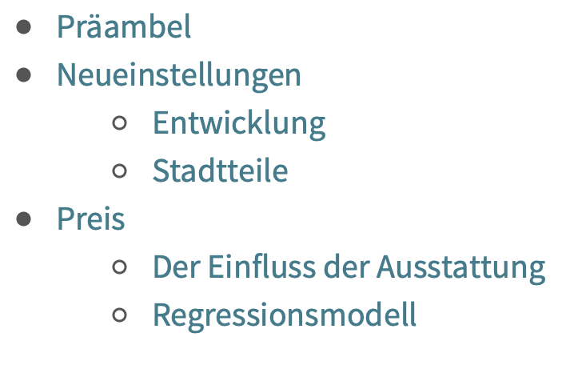
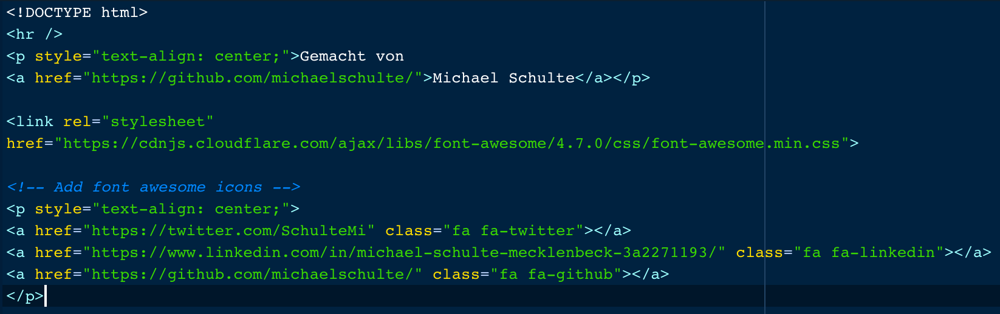
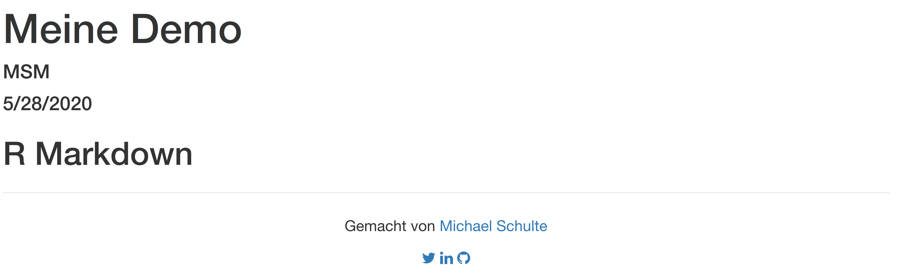
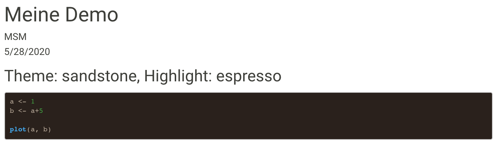

layout: true

<div class="my-footer">
  <span style="text-align:center">
    <span> 
      
    </span>
    <a href="https://therbootcamp.github.io/">
      <span style="padding-left:82px"> 
        <font color="#7E7E7E">
          www.therbootcamp.com
        </font>
      </span>
    </a>
    <a href="https://therbootcamp.github.io/">
      <font color="#7E7E7E">
       Reporting mit R | Juni 2020
      </font>
    </a>
    </span>
  </div> 

---

```{r setup, include=FALSE}
options(htmltools.dir.version = FALSE)
options(width = 110)
options(digits = 4)

# Load packages
require(tidyverse)
require(knitr)

# load color set
source("../../_materials/palette/therbootcamp_palettes.R")

# knitr options
knitr::opts_chunk$set(dpi = 300, 
                      echo = FALSE, 
                      warning = FALSE, 
                      fig.align = 'center', 
                      message= FALSE,
                      comment = NA)
# special print function: avoid if possible
print2 <- function(x, nlines=10,...) {
   cat(head(capture.output(print(x,...)), nlines), sep="\n")}

# load data
airbnb <- read_csv("1_Data/airbnb.csv")

```

# Kleiner Ausflug nach HTML und CSS

---

# HTML

.pull-left4[

<ul>
  <li class="m1"><span><high>Hypertext Markup Language</high> graphische Gestaltung eines Textes mit <high>Tags<high></span></li> 
    <li class="m2"><span>Im <high>Browser</high> wird HTML gerendert (übersetzt) und dargestellt</span></li> 
  </ul>

<table style="cellspacing:0; cellpadding:0; border:none; padding-top:10px" width=100%>
  <col width="40%">
  <col width="60%">
<tr>
  <td bgcolor="white">
    <b>Tag</b>   
  </td>
  <td bgcolor="white">
    <b>Beschreibung</b>
  </td> 
</tr>
<tr>
  <td bgcolor="white">
  <mono>h1, h2,...</mono> </td>
  <td bgcolor="white">
  <high>Überschrift</high> Level 1, 2,...
  </td> 
</tr>
<tr>
  <td bgcolor="white">
  <mono>br</mono>
  </td>
  <td bgcolor="white">
   <high>Neue Zeile</high>    
  </td> 
</tr>
<tr>
  <td bgcolor="white">
  <mono>b</mono>
  </td>
  <td bgcolor="white">
  <high>fett</high> 
  </td> 
</tr>
<tr>
  <td bgcolor="white">
  <mono>i</mono> 
  </td>
  <td bgcolor="white">
  <high>kursiv
  </td> 
</tr>
</table>
]

.pull-right5[

````html
<h1>Präambel</h1>
Dieser <i>Bericht</i> evaluiert 
<b>Veränderungen</b> in den ...
<br>
Er wurde zum Zwecke der <b>Übung</b> ...
````

<h1>Präambel</h1>
Dieser <i>Bericht</i> evaluiert 
<b>Veränderungen</b> in den Neueinstellungen und den Preisen von AirBnB Objekten in Berlin, Deutschland. 
<br>
Er wurde zum Zwecke der <b>Übung</b> auf Basis öffentlich verfügbarer Daten erstellt und repräsentiert einzig die Position der Autoren

]

---

# CSS

.pull-left4[

<ul>
  <li class="m1"><span>Cascading <high>Style Sheets</high> beschreiben <high>wie</high> HTML Tags formatiert werden</span></li> 
  <li class="m2"><span>Der <high>CSS Selector</high> (z.B. h1) mit verschiedenen <high>Deklarationen</high> (zB: color: blue) erweitern</span></li> 
  </ul>

<table style="cellspacing:0; cellpadding:0; border:none; padding-top:10px" width=100%>
  <col width="40%">
  <col width="60%">
<tr>
  <td bgcolor="white">
    <b>Element</b>   
  </td>
  <td bgcolor="white">
    <b>Beschreibung</b>
  </td> 
</tr>
<tr>
  <td bgcolor="white">
  <mono>style</mono> </td>
  <td bgcolor="white">
  Beschreibung der <high>Darstellung</high>
  </td> 
</tr>
<tr>
  <td bgcolor="white">
  <mono>color</mono>
  </td>
  <td bgcolor="white">
  <high>Farbwahl</high> <mono>blue, red, #6BB7B9</mono> 
  </td> 
</tr>
<tr>
  <td bgcolor="white">
  <mono>font-size</mono> und
    <mono>font-family</mono>
  </td>
  <td bgcolor="white">
  <high>Schrift</high>grösse und -art
  </td> 
</tr>
<tr>
  <td bgcolor="white">
  <mono>div</mono> 
  </td>
  <td bgcolor="white">
  <high>Kontainer</high> für beliebigen Inhalt
  </td> 
</tr>
</table>
]

.pull-right5[

````html
<h1 style = "color: #6BB5B9">Präambel</h1>
<div style = "font-family: Arial; 
font-size: 25px">
Dieser <i>Bericht</i> evaluiert 
<b>Veränderungen</b> ... .</div> 

````

<h1 style = "color: #6BB5B9">Präambel</h1>
<div style = "font-family: Arial; font-size: 25px">
Dieser <i>Bericht</i> evaluiert <b>Veränderungen</b> in den Neueinstellungen und den Preisen von AirBnB Objekten in Berlin, Deutschland. 
]

---

# CSS

.pull-left4[

<ul>
  <li class="m1"><span>Cascading <high>Style Sheets</high> können auch global definiert werden</span></li> 
  <li class="m2"><span>Dafür wird ein <high>externes</high> file <mono>*.css</mono> erstellt und in Markdown <high>eingebunden</high> </span></li> 
  </ul>

]

.pull-right5[

airbnb.css
````html
h3, h4 {
  font-weight: 500;
  color: #555555;
}

table td {
  vertical-align: top;
}

a, a:hover {
  color: #007D8C;
}

body {
  background-image: url(watermark.svg);
  background-repeat: repeat-y;
  background-size: contain;
}
````
]

---

# YAML

.pull-left4[

<ul>
  <li class="m1"><span>Jedes Markdown Dokument beginnt mit einem <high>YAML header</high></span></li> 
  <li class="m2"><span>YAML ist ein rekursives Akronym: <high>YAML Ain't Markup Language</high></span></li> 
  <li class="m3"><span>Als Default müssen immer <high>Titel</high>, <high>Autor</high> und <high>Datum</high> gesetzt werden
  <li class="m4"><span>Diese 3 Angaben werden <high>als Erstes</high> im HTML Dokument <high>angezeigt</high></span></li>  
  </ul>

]

.pull-right5[

````html
---
title: "Dokument Titel"
author: "MSM"
date: "6/1/2020"
output: html_document
---
````

]

---

# Inhaltsverzeichnis

.pull-left4[

<ul>
  <li class="m1"><span>Aus den Überschriften (#, ##) kann mit <mono>toc: true</mono> ein <high>Inhaltsverzeichnis</high> erstellt werden</span></li>
  <li class="m2"><span>Dabei wird mit <mono>toc_depth</mono> die <high>Tiefe</high> bestimmt</span></li> 
</ul>


<table style="cellspacing:0; cellpadding:0; border:none; padding-top:10px" width=100%>
  <col width="40%">
  <col width="60%">
<tr>
  <td bgcolor="white">
    <b>Element</b>   
  </td>
  <td bgcolor="white">
    <b>Beschreibung</b>
  </td> 
</tr>
<tr>
  <td bgcolor="white">
  <mono>toc</mono> </td>
  <td bgcolor="white">
  Inhaltsverzeichnis <high>anzeigen</high> <mono>TRUE</mono> oder <mono>FALSE</mono>
  </td> 
</tr>
<tr>
  <td bgcolor="white">
  <mono>toc_depth</mono>
  </td>
  <td bgcolor="white">
  mit 2: Überschriften Level 1 + Level 2
  </td> 
</tr>

</table>
]

.pull-right5[

````markdown
date: "6/1/2020"
output:
  html_document:
    toc: true
    toc_depth: 5
````

<p align="center" width="100%">
  
</p>
]

---

# Footer und Header

.pull-left4[

<ul>
  <li class="m1"><span><high>Header</high> werden in externe HTML files gespeichertd</span></li> 
  <li class="m2"><span>Die HTML files werden dann im YAML header geladen</span></li>
  </ul>

<table style="cellspacing:0; cellpadding:0; border:none; padding-top:10px" width=100%>
  <col width="40%">
  <col width="60%">
<tr>
  <td bgcolor="white">
    <b>Element</b>   
  </td>
  <td bgcolor="white">
    <b>Beschreibung</b>
  </td> 
</tr>
<tr>
  <td bgcolor="white">
  <mono>after_body</mono> </td>
  <td bgcolor="white">

  </td> 
</tr>
<tr>
  <td bgcolor="white">
  <mono>before_body</mono>
  </td>
  <td bgcolor="white">

  </td> 
</tr>
<tr>
  <td bgcolor="white">
  <mono>in_header</mono> und
    <mono>font-family</mono>
  </td>
  <td bgcolor="white">
  </td> 
</tr>

</table>
]

.pull-right5[

````html
date: "5/28/2020"
output: 
  html_document:
    includes:
      in_header: ../2_Assets/header.Rhtml
````

````html
<html>
  <div style="text-align:center;width=100%;background-color:rgba(0,125,140,.3);border-bottom:4px solid #007D8C;font-family:Helvetica;margin-bottom:20px">
  <table style="width:100%">
  <col 70%>
  <col 30%>
  <tr>
    <td align="left">
      <p style="color: #007D8C;font-size:100px;padding-left:20px;padding-top:40px;line-height:50%"><b>Berlin</b><br><font style="font-size:40px;color:white;padding-left:6px">Bericht 18/19</font></p>
    </td>
    <td align="right">
      </img>
    </td>
  </tr>
  </table>
  </div>
</html>
````

]

---


.pull-left4[
<ul>
  <li class="m1"><span>Um einen Footer/Header zu erstellen brauchen wir ein <high>externes HTML file</high> </li>
  <li class="m2"><span>Diese File wird dann mit <high>includes: after_body</high> (bzw <highm> before_body</highm>) eingebunden </li>
</ul>

````markdown
title: "Meine Demo"
author: "MSM"
date: "5/28/2020"
output: 
  html_document:
    includes:
      after_body: footer.html
```` 

]

.pull-right5[

<p align="center" width="100%">
  
</p>

<p align="center" width="100%">
  
</p>

ich weiss ... das sieht scheisse aus ... HTML Document einbinden .. Ideas?
]

---

# Themes und Highlight

.pull-left4[
<ul>
  <li class="m1"><span>Direkt <high>vorgefertigte Themes und Code Highlights</high>  einbinden </span></li>
  <li class="m2"><span>Beides wird im YAML <high>header<high> festgelegt</span></li>
</ul>

````markdown
title: "Meine Demo"
author: "MSM"
date: "5/28/2020"
output: 
  html_document:
    theme: sandstone
    highlight: espresso
```` 
]

.pull-right5[

<p align="center" width="100%">
  
</p>

Themes: "default", "cerulean", "journal", "flatly", "darkly", "readable", "spacelab", "united", "cosmo", "lumen", "paper", "sandstone", "simplex", "yeti"

Highlight: "default", "tango", "pygments", "kate", "monochrome", "espresso", "zenburn", "haddock", "textmate"

]

---

class: middle, center

<h1><a href="https://therbootcamp.github.io/RmR_2020Jun/_sessions/_Markdown3/Markdown3_practical.html">Practical</a></h1>

