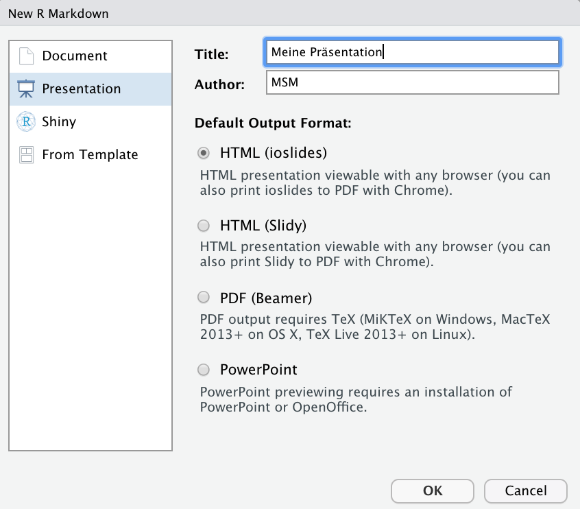
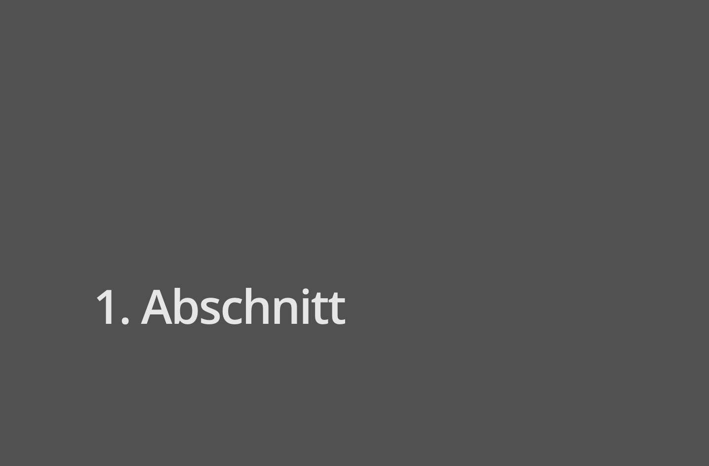
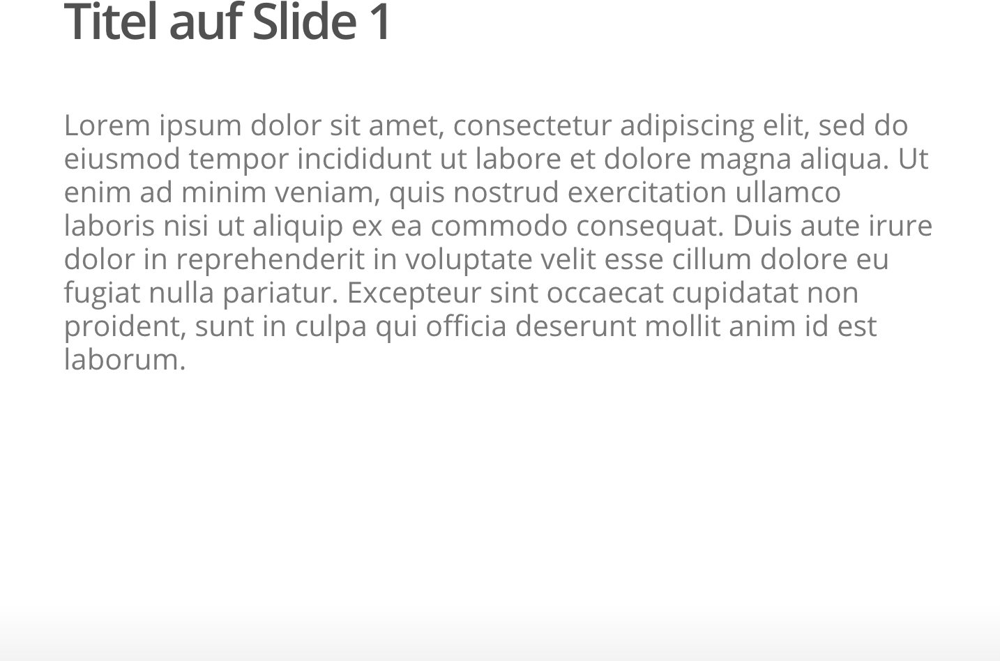
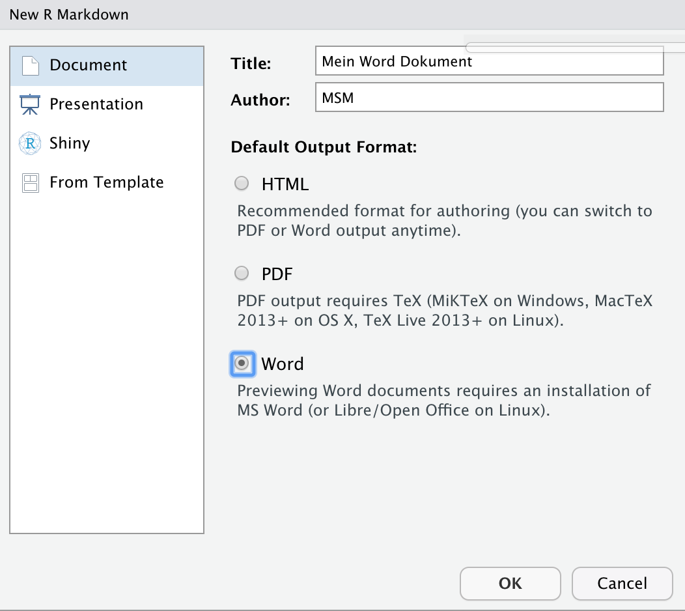
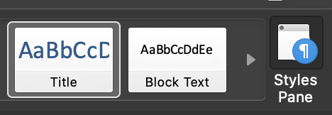
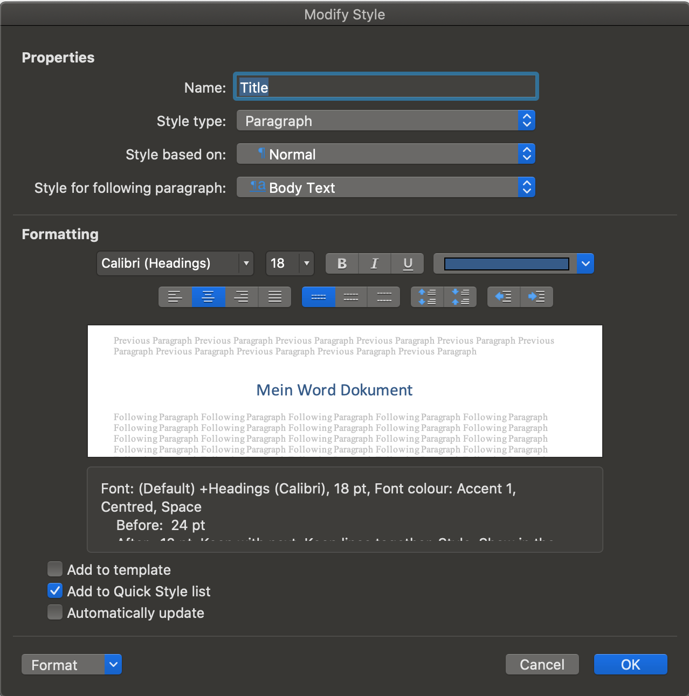
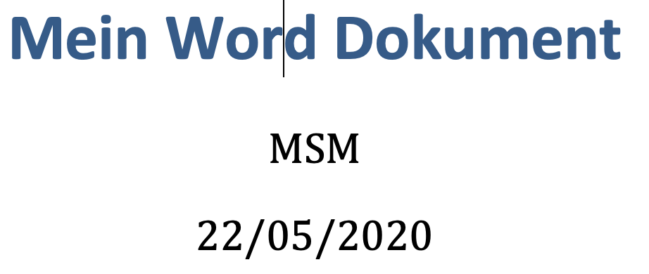
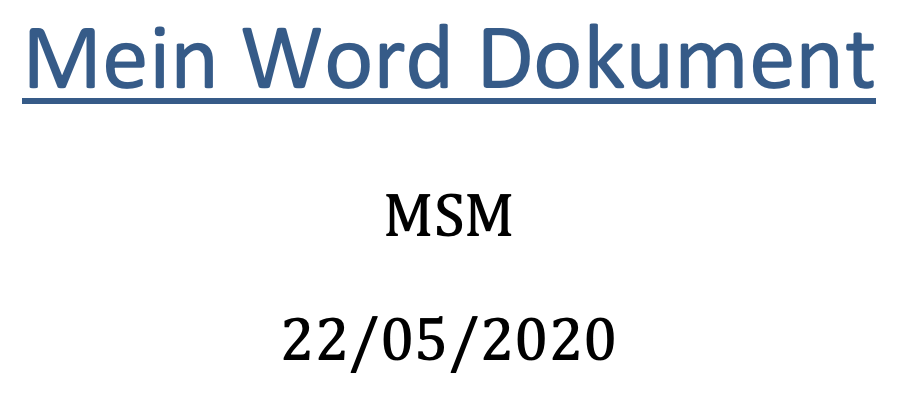

layout: true

<div class="my-footer">
  <span style="text-align:center">
    <span> 
      
    </span>
    <a href="https://therbootcamp.github.io/">
      <span style="padding-left:82px"> 
        <font color="#7E7E7E">
          www.therbootcamp.com
        </font>
      </span>
    </a>
    <a href="https://therbootcamp.github.io/">
      <font color="#7E7E7E">
       Reporting mit R | Juni 2020
      </font>
    </a>
    </span>
  </div> 

---

```{r setup, include=FALSE}
options(htmltools.dir.version = FALSE)
options(width = 110)
options(digits = 4)

# Load packages
require(tidyverse)
require(knitr)
require(stargazer)

# load color set
source("../../_materials/palette/therbootcamp_palettes.R")

# knitr options
knitr::opts_chunk$set(dpi = 300, 
                      echo = FALSE, 
                      warning = FALSE, 
                      fig.align = 'center', 
                      message= FALSE,
                      comment = NA)
# special print function: avoid if possible
print2 <- function(x, nlines=10,...) {
   cat(head(capture.output(print(x,...)), nlines), sep="\n")}

# load data
airbnb <- read_csv("1_Data/airbnb.csv")

```

# Präsentationen

---

# Präsentationen

.pull-left4[
<ul>
  <li class="m1"><span>New File - R Markdown - Presentation</span></li>
</ul>

<table style="cellspacing:0; cellpadding:0; border:none; padding-top:10px" width=100%>
  <col width="40%">
  <col width="60%">
<tr>
  <td bgcolor="white">
    <b>Element</b>   
  </td>
  <td bgcolor="white">
    <b>Beschreibung</b>
  </td> 
</tr>
<tr>
  <td bgcolor="white">
  <mono>output</mono> </td>
  <td bgcolor="white">
  <high>ioslides_presentation</high>  
  </td> 
</tr>
</table>

]

.pull-right5[

````markdown
title: "Meine Präsentation"
author: "MSM"
date: "5/25/2020"
output: ioslides_presentation
````

<p align="center" width="100%">
  
</p>
 
]

---

.pull-left4[
# Präsentation
<ul>
  <li class="m1"><span><high>Unterschiede</high> in der Formatierung der Elemente</span></li>
</ul>

<table style="cellspacing:0; cellpadding:0; border:none; padding-top:10px" width=100%>
  <col width="40%">
  <col width="60%">
<tr>
  <td bgcolor="white">
    <b>Element</b>   
  </td>
  <td bgcolor="white">
    <b>Beschreibung</b>
  </td> 
</tr>
<tr>
  <td bgcolor="white">
  <mono>#</mono> </td>
  <td bgcolor="white">
  <high>Neuer Abschnitt</high> mit Abschnitt-Überschrift
  </td> 
</tr>
<tr>
  <td bgcolor="white">
  <mono>##</mono>
  </td>
  <td bgcolor="white">
<high>Neuer Slide</high> mit Slide Überschrift
  </td> 
</tr>
<tr>
  <td bgcolor="white">
  <mono>-</mono>
  </td>
  <td bgcolor="white">
<high>Bullet</high> points
  </td> 
</tr>
<tr>
  <td bgcolor="white">
  <mono>>-</mono>
  </td>
  <td bgcolor="white">
Bullet points <high>inkrementell</high>
  </td> 
</tr>
<tr>
  <td bgcolor="white">
  <mono>1., 2. ...</mono>
  </td>
  <td bgcolor="white">
<high>Liste</high> mit Nummerierung
  </td> 
</tr>
</table>

]
<br>
.pull-right5[

````markdown
title: "Meine Präsentation"
author: "MSM"
date: "5/25/2020"
output: ioslides_presentation

# Erster Abschnitt
## Titel auf Slide 1

- Bullet 1
- Bullet 2
````

<p align="center" width="100%">
  
  
</p>
 
]

---

# Präsentation gestalten

.pull-left4[
<ul>
  <li class="m1"><span>Eigene <high>Hintergrundbilder</high> einfügen mit <highm>data_background</highm></span></li>
</ul>

````markdown
title: "Meine Präsentation"
author: "MSM"
date: "5/25/2020"
output: ioslides_presentation

## Mein eigener Hintergrund 
{data-background=xp.png 
data-background-size=cover}
````

]

.pull-right5[

<p align="center" width="100%">
  
</p>
 
]

---

# Neue Markdown Datei - Word

.pull-left4[
<ul>
  <li class="m1"><span>New File - R Markdown - Word</span></li>
</ul>

<table style="cellspacing:0; cellpadding:0; border:none; padding-top:10px" width=100%>
  <col width="40%">
  <col width="60%">
<tr>
  <td bgcolor="white">
    <b>Element</b>   
  </td>
  <td bgcolor="white">
    <b>Beschreibung</b>
  </td> 
</tr>
<tr>
  <td bgcolor="white">
  <mono>output</mono> </td>
  <td bgcolor="white">
  <high>word_document</high>  
  </td> 
</tr>
</table>


]

.pull-right5[

````markdown
title: "Mein Dokument"
author: "MSM"
date: "5/25/2020"
output: word_document
````

<p align="center" width="100%">
  
</p>
 
]

---

# Externes Word Template

.pull-left4[
<ul>
  <li class="m1"><span>Word template erstellen</span></li>
  <li class="m2"><span>Formatierung in Word anpassen</span></li>
  <li class="m3"><span>Als Vorlage in Markdown einbinden</span></li>
</ul>

````markdown
title: "Mein Word Dokument"
author: MSM
date: 22/05/2020
output: 
 word_document:
 reference_docx: Word_Template.docx
````


]

.pull-right5[

<p align="center" width="100%">
  
  
</p>
 
]

---

# Externes Word Template

.pull-left4[
<ul>
  <li class="m1"><span>Word template erstellen</span></li>
  <li class="m2"><span>Formatierung in Word anpassen</span></li>
  <li class="m3"><span>Als Vorlage in Markdown einbinden</span></li>
</ul>

````markdown
title: "Mein Word Dokument"
author: MSM
date: 22/05/2020
output: 
 word_document:
 reference_docx: Word_Template.docx
````

]

.pull-right5[

<p align="center" width="100%">
  
  
</p>
 
]

---

class: middle, center

<h1><a href="https://therbootcamp.github.io/RmR_2020Jun/_sessions/_Markdown4/Markdown4_practical.html">Practical</a></h1>

