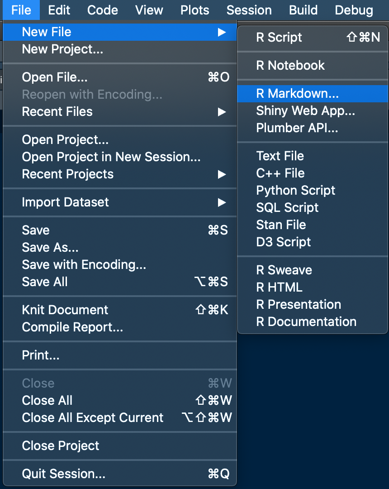
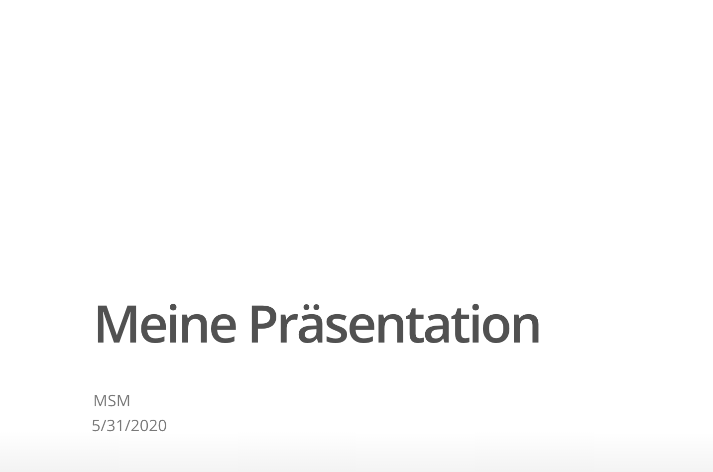
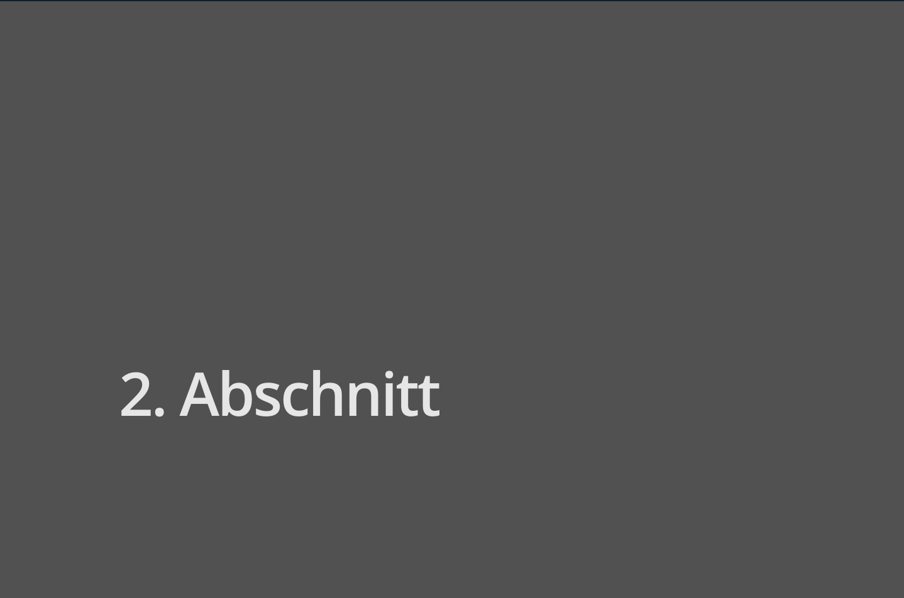
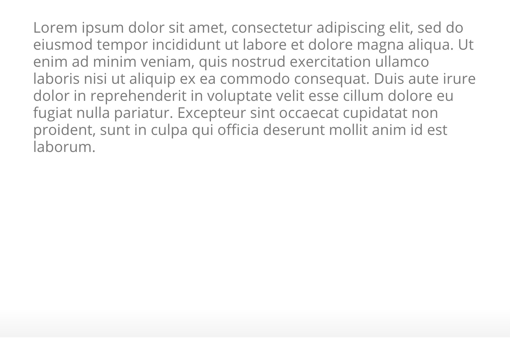
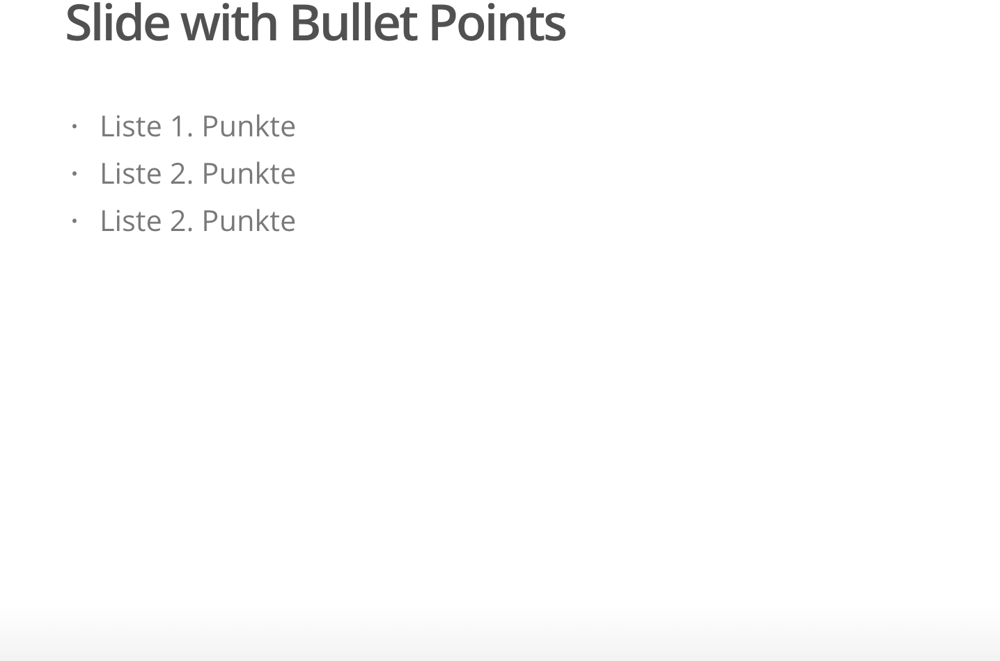
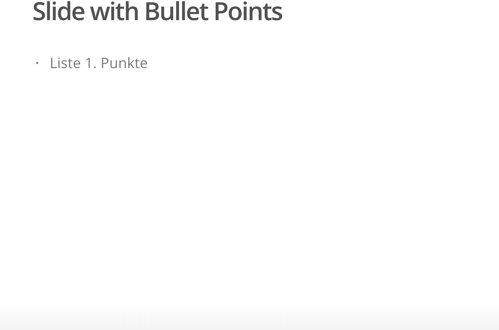

layout: true

<div class="my-footer">
  <span style="text-align:center">
    <span> 
      
    </span>
    <a href="https://therbootcamp.github.io/">
      <span style="padding-left:82px"> 
        <font color="#7E7E7E">
          www.therbootcamp.com
        </font>
      </span>
    </a>
    <a href="https://therbootcamp.github.io/">
      <font color="#7E7E7E">
       Reporting mit R | Juni 2020
      </font>
    </a>
    </span>
  </div> 

---

```{r setup, include=FALSE}
options(htmltools.dir.version = FALSE)
options(width = 110)
options(digits = 4)

# Load packages
require(tidyverse)
require(knitr)
require(stargazer)

# load color set
source("../../_materials/palette/therbootcamp_palettes.R")

# knitr options
knitr::opts_chunk$set(dpi = 300, 
                      echo = FALSE, 
                      warning = FALSE, 
                      fig.align = 'center', 
                      message= FALSE,
                      comment = NA)
# special print function: avoid if possible
print2 <- function(x, nlines=10,...) {
   cat(head(capture.output(print(x,...)), nlines), sep="\n")}

# load data
airbnb <- read_csv("1_Data/airbnb.csv")

```

# HTML / Power Point Slides | Export nach Word und Power Point

Direkt Word und Power Point Dateien mit R erstellen.

---

# Neue Markdown Datei - Präsentation

.pull-left4[
<ul>
  <li class="m1"><span>New File - R Markdown</span></li>
</ul>

]

.pull-right5[

<p align="center" width="100%">
  
</p>
 
]

---

# Neue Markdown Datei - Präsentation

.pull-left4[
<ul>
  <li class="m1"><span>New File - R Markdown</span></li>
  <li class="m2"><span>Presentation - HTML (ioslides)</span></li>
</ul>

````markdown
title: "Meine Präsentation"
author: "MSM"
date: "5/25/2020"
output: ioslides_presentation
````

]

.pull-right5[

<p align="center" width="100%">
  
</p>
 
]

---

# Präsentation formatieren

.pull-left4[
<ul>
  <li class="m1"><span><high>Formatierung</high> von Abschnitten mit # - automatisch auf <high>neuem Slide</high></span></li>
</ul>

````markdown
title: "Meine Präsentation"
author: "MSM"
date: "5/25/2020"
output: ioslides_presentation

# Erster Abschnitt

# Zweiter Abschnitt

````

]

.pull-right5[

<p align="center" width="100%">
  
  
  
</p>
 
]

---

# Präsentation formatieren

.pull-left4[
<ul>
  <li class="m1"><span><high>Formatierung</high> von Abschnitten mit # - automatisch auf <high>neuem Slide</high></span></li>
  <li class="m2"><span><high>Titel</high> für Slides werden mit ## erstellt</span></li>
</ul>

````markdown
title: "Meine Präsentation"
author: "MSM"
date: "5/25/2020"
output: ioslides_presentation

## Titel auf Slide 1
Lorem Ipsum ...

## Titel auf Slide 2
Lorem Ipsum ...

````

]

.pull-right5[

<p align="center" width="100%">
  
  
</p>
 
]

---

# Präsentation formatieren

.pull-left4[
<ul>
  <li class="m1"><span><high>Formatierung</high> von Abschnitten mit # - automatisch auf <high>neuem Slide</high></span></li>
  <li class="m2"><span><high>Titel</high> für Slides werden mit ## erstellt</span></li>
  <li class="m2"><span>Explizit <high>neuen Slide einfügen </high> (ohne extra Titel) mit --- </span></li>
</ul>

````markdown
title: "Meine Präsentation"
author: "MSM"
date: "5/25/2020"
output: ioslides_presentation

# Erster Abschnitt

## Titel auf Slide 1
Lorem Ipsum ...

 ---

Lorem Ipsum ...

````

]

.pull-right5[

<p align="center" width="100%">
  
  
</p>
 
]

---

# Präsentation gestalten

.pull-left4[
<ul>
  <li class="m1"><span><high>Bullet Points</high> mit - einfügen</span></li>
</ul>

````markdown
title: "Meine Präsentation"
author: "MSM"
date: "5/25/2020"
output: ioslides_presentation

## Slide mit Bullet Points

- Liste 1. Punkt
- Liste 2. Punkt
- Liste 3. Punkt
````

]

.pull-right5[

<p align="center" width="100%">
  
</p>
 
]

---

# Präsentation gestalten

.pull-left4[
<ul>
  <li class="m1"><span><high>Bullet Points</high> mit - einfügen</span></li>
  <li class="m1"><span>Bullet Points, die <high>inkrementell</high> dargestellt werden sollen mit > - kennzeichnen</span></li>
</ul>

````markdown
title: "Meine Präsentation"
author: "MSM"
date: "5/25/2020"
output: ioslides_presentation

## Slide mit Bullet Points

> - Liste 1. Punkt
> - Liste 2. Punkt
> - Liste 3. Punkt
````

]

.pull-right5[

<p align="center" width="100%">
  
  
  
</p>
 
]

---

# Präsentation gestalten

.pull-left4[
<ul>
  <li class="m1"><span>Eigene <high>Hintergrundbilder</high> einfügen mit <highm>data_background</highm></span></li>
</ul>

````markdown
title: "Meine Präsentation"
author: "MSM"
date: "5/25/2020"
output: ioslides_presentation

## Mein eigener Hintergrund 
{data-background=xp.png 
data-background-size=cover}
````

]

.pull-right5[

<p align="center" width="100%">
  
</p>
 
]

---

# Neue Markdown Datei - Word

.pull-left4[
<ul>
  <li class="m1"><span>New File - R Markdown</span></li>
</ul>


]

.pull-right5[

<p align="center" width="100%">
  
</p>
 
]

---

# Neue Markdown Datei - Word

.pull-left4[
<ul>
  <li class="m1"><span>New File - R Markdown</span></li>
  <li class="m2"><span>Word</span></li>
</ul>

````markdown
title: "Mein Dokument"
author: "MSM"
date: "5/25/2020"
output: word_document
````

]

.pull-right5[

<p align="center" width="100%">
  
</p>
 
]


---

# Externes Word Template Formatieren

.pull-left4[
<ul>
  <li class="m1"><span>Word template erstellen</span></li>
  <li class="m2"><span>Formatierung in Word anpassen</span></li>
  <li class="m3"><span>Als Vorlage in Markdown einbinden</span></li>
</ul>

````markdown
title: "Mein Word Dokument"
author: MSM
date: 22/05/2020
output: 
 word_document:
 reference_docx: Word_Template.docx
````


]

.pull-right5[

<p align="center" width="100%">
  
  
</p>
 
]

---

# Externes Word Template Formatieren

.pull-left4[
<ul>
  <li class="m1"><span>Word template erstellen</span></li>
  <li class="m2"><span>Formatierung in Word anpassen</span></li>
  <li class="m3"><span>Als Vorlage in Markdown einbinden</span></li>
</ul>

````markdown
title: "Mein Word Dokument"
author: MSM
date: 22/05/2020
output: 
 word_document:
 reference_docx: Word_Template.docx
````

]

.pull-right5[

<p align="center" width="100%">
  
  
</p>
 
]

---

class: middle, center

<h1><a href="https://therbootcamp.github.io/RmR_2020Jun/_sessions/_Markdown4/Markdown4_practical.html">Practical</a></h1>

